# day01

## 一、为什么要学习Vue

1.前端必备技能

2.岗位多，绝大互联网公司都在使用Vue

3.提高开发效率

4.高薪必备技能（Vue2+Vue3）


## 二、什么是Vue

概念：Vue (读音 /vjuː/，类似于 view) 是一套 **构建用户界面 ** 的 **渐进式** **框架**

Vue2官网：<https://v2.cn.vuejs.org/>

### 1.什么是构建用户界面

**基于数据**渲染出用户可以看到的**界面**

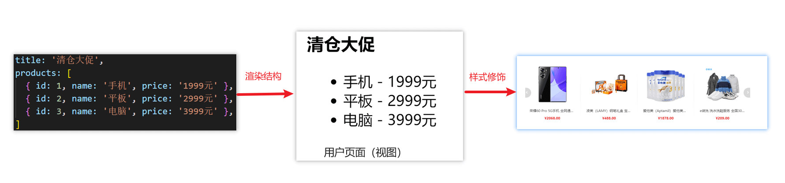

### 2.什么是渐进式

所谓渐进式就是循序渐进，不一定非得把Vue中的所有API都学完才能开发Vue，可以学一点开发一点

#### Vue的两种开发方式：

1. Vue核心包开发

   场景：局部模块改造

2. Vue核心包&Vue插件&工程化

   场景：整站开发


### 3.什么是框架

所谓框架：就是一套完整的解决方案

**举个栗子**	

如果把一个完整的项目比喻为一个装修好的房子，那么框架就是一个毛坯房。

我们只需要在“毛坯房”的基础上，增加功能代码即可。

提到框架，不得不提一下库。

- 库，类似工具箱，是一堆方法的集合，比如 axios、lodash、echarts等
- 框架，是一套完整的解决方案，实现了大部分功能，我们只需要按照一定的规则去编码即可。

下图是 库 和 框架的对比。

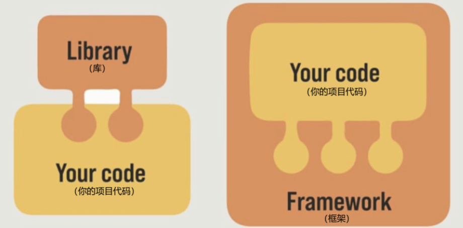

框架的特点：有一套必须让开发者遵守的**规则**或者**约束**

咱们学框架就是学习的这些规则 [官网](https://v2.cn.vuejs.org/)

### 总结：什么是Vue？

Vue是什么：

什么是构建用户界面：

什么是渐进式：

什么是框架：


## 三、创建Vue实例

我们已经知道了Vue框架可以 基于数据帮助我们渲染出用户界面，那应该怎么做呢？


比如就上面这个数据，基于提供好的msg 怎么渲染后右侧可展示的数据呢？

**核心步骤（4步）：**

1. 准备容器
2. 引包（官网） — 开发版本/生产版本
3. 创建Vue实例  new Vue()
4. 指定配置项，渲染数据
   1. el:指定挂载点
   2. data提供数据

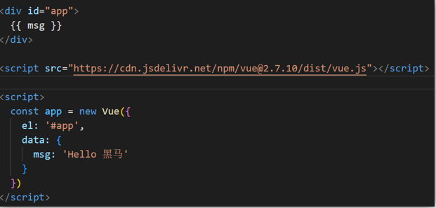

**总结：创建Vue实例需要执行哪4步**


## 四、插值表达式 {{}}

插值表达式是一种Vue的模板语法

我们可以用插值表达式渲染出Vue提供的数据

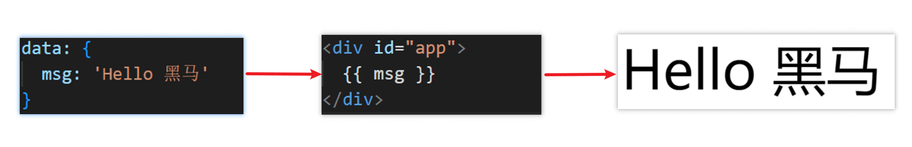

### 1.作用：利用表达式进行插值，渲染到页面中

表达式：是可以被求值的代码，JS引擎会讲其计算出一个结果

以下的情况都是表达式：

```js
money + 100
money - 100
money * 10
money / 10 
price >= 100 ? '真贵':'还行'
obj.name
arr[0]
fn()
obj.fn()
```


### 2.语法

插值表达式语法：{{ 表达式 }}

```js
<h3>{{title}}<h3>

<p>{{nickName.toUpperCase()}}</p>

<p>{{age >= 18 ? '成年':'未成年'}}</p>

<p>{{obj.name}}</p>

<p>{{fn()}}</p>
```


### 3.错误用法

```js
1.在插值表达式中使用的数据 必须在data中进行了提供
<p>{{hobby}}</p>  //如果在data中不存在 则会报错

2.支持的是表达式，而非语句，比如：if   for ...
<p>{{if}}</p>

3.不能在标签属性中使用 {{  }} 插值 (插值表达式只能标签中间使用)
<p title="{{username}}">我是P标签</p>
```


### 4.总结

1.插值表达式的作用是什么

2.语法是什么

3.插值表达式的注意事项


## 五、响应式特性

### 1.什么是响应式？

​	简单理解就是数据变，视图对应变。 


### 2.如何访问 和 修改 data中的数据（响应式演示）

data中的数据, 最终会被添加到实例上

① 访问数据： "实例.属性名"

② 修改数据： "实例.属性名"= "值"

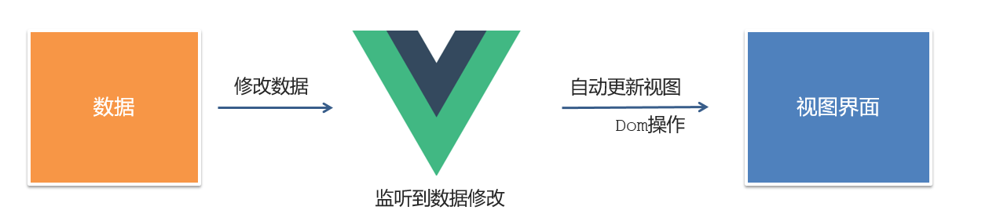


### 3.总结

1.  什么是响应式
2. 如何访问和修改data中的数据呢


## 六、Vue开发者工具安装

1. 通过谷歌应用商店安装（国外网站）
2. 极简插件下载（推荐） <https://chrome.zzzmh.cn/index>

安装步骤：

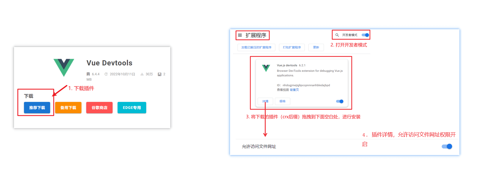


安装之后可以F12后看到多一个Vue的调试面板

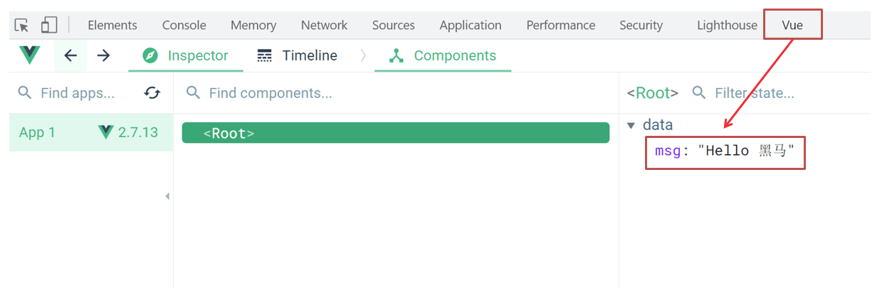


## 七、Vue中的常用指令

**概念：**指令（Directives）是 Vue 提供的带有 **v- 前缀** 的 特殊 标签**属性**。

为啥要学：提高程序员操作 DOM 的效率。

vue 中的指令按照不同的用途可以分为如下 6 大类：

-  内容渲染指令（v-html、v-text）
-  条件渲染指令（v-show、v-if、v-else、v-else-if）
-  事件绑定指令（v-on）
-  属性绑定指令 （v-bind）
-  双向绑定指令（v-model）
-  列表渲染指令（v-for）

指令是 vue 开发中最基础、最常用、最简单的知识点。


## 八、内容渲染指令

内容渲染指令用来辅助开发者渲染 DOM 元素的文本内容。常用的内容渲染指令有如下2 个：

- v-text（类似innerText）


- - 使用语法：`<p v-text="uname">hello</p>`，意思是将 uame 值渲染到 p 标签中
  - 类似 innerText，使用该语法，会覆盖 p 标签原有内容


- v-html（类似 innerHTML）


- - 使用语法：`<p v-html="intro">hello</p>`，意思是将 intro 值渲染到 p 标签中
  - 类似 innerHTML，使用该语法，会覆盖 p 标签原有内容
  - 类似 innerHTML，使用该语法，能够将HTML标签的样式呈现出来。

代码演示：

```js
 
  <div id="app">
    <h2>个人信息</h2>
	// 既然指令是vue提供的特殊的html属性，所以咱们写的时候就当成属性来用即可
    <p v-text="uname">姓名：</p> 
    <p v-html="intro">简介：</p>
  </div> 

<script>
        const app = new Vue({
            el:'#app',
            data:{
                uname:'张三',
                intro:'<h2>这是一个<strong>非常优秀</strong>的boy<h2>'
            }
        })
</script>
```


## 九、条件渲染指令

条件判断指令，用来辅助开发者按需控制 DOM 的显示与隐藏。条件渲染指令有如下两个，分别是：

1. v-show

   1. 作用：  控制元素显示隐藏
   2. 语法：  v-show = "表达式"   表达式值为 true 显示， false 隐藏
   3. 原理：  切换 display:none 控制显示隐藏
   4. 场景：频繁切换显示隐藏的场景

   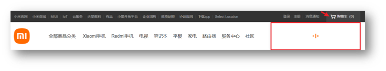

2. v-if

   1. 作用：  控制元素显示隐藏（条件渲染）
   2. 语法：  v-if= "表达式"          表达式值 true显示， false 隐藏
   3. 原理：  基于条件判断，是否创建 或 移除元素节点
   4. 场景：  要么显示，要么隐藏，不频繁切换的场景

   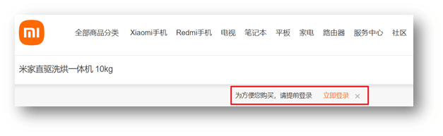

   示例代码：

   ```js
     <div id="app">
       <div v-show="flag" class="box">我是v-show控制的盒子</div>
       <div v-if="flag" class="box">我是v-if控制的盒子</div>
     </div>

     <script src="https://cdn.jsdelivr.net/npm/vue@2/dist/vue.js"></script>
     <script>
       const app = new Vue({
         el: '#app',
         data: {
           flag: false
         }
       })
     </script>
   ```

3. v-else 和 v-else-if

   1. 作用：辅助v-if进行判断渲染
   2. 语法：v-else  v-else-if="表达式"
   3. 需要紧接着v-if使用

示例代码：

```js
  <div id="app">
    <p v-if="gender === 1">性别：♂ 男</p>
    <p v-else>性别：♀ 女</p>
    <hr>
    <p v-if="score >= 90">成绩评定A：奖励电脑一台</p>
    <p v-else-if="score >= 70">成绩评定B：奖励周末郊游</p>
    <p v-else-if="score >= 60">成绩评定C：奖励零食礼包</p>
    <p v-else>成绩评定D：惩罚一周不能玩手机</p>
  </div>
  
  <script src="https://cdn.jsdelivr.net/npm/vue@2/dist/vue.js"></script>
  <script>

    const app = new Vue({
      el: '#app',
      data: {
        gender: 2,
        score: 95
      }
    })
  </script>
```


## 十、事件绑定指令

使用Vue时，如需为DOM注册事件，及其的简单，语法如下：

- <button v-on:事件名="内联语句">按钮</button>
- <button v-on:事件名="处理函数">按钮</button>
- <button v-on:事件名="处理函数(实参)">按钮</button>
- `v-on:` 简写为 **@**

1. 内联语句

   ```js
   <div id="app">
       <button @click="count--">-</button>
       <span>{{ count }}</span>
       <button v-on:click="count++">+</button>
     </div>
     <script src="https://cdn.jsdelivr.net/npm/vue@2/dist/vue.js"></script>
     <script>
       const app = new Vue({
         el: '#app',
         data: {
           count: 100
         }
       })
     </script>
   ```

2. 事件处理函数

   注意：

   - 事件处理函数应该写到一个跟data同级的配置项（methods）中
   - methods中的函数内部的this都指向Vue实例

```js
<div id="app">
    <button>切换显示隐藏</button>
    <h1 v-show="isShow">黑马程序员</h1>
  </div>
  <script src="https://cdn.jsdelivr.net/npm/vue@2/dist/vue.js"></script>
  <script>
    const app = new Vue({
      el: '#app',
      data: {
        isShow: true
      }
    })
  </script>
```

  3.给事件处理函数传参

- 如果不传递任何参数，则方法无需加小括号；methods方法中可以直接使用 e 当做事件对象


- 如果传递了参数，则实参 `$event` 表示事件对象，固定用法。

```js
 <style>
    .box {
      border: 3px solid #000000;
      border-radius: 10px;
      padding: 20px;
      margin: 20px;
      width: 200px;
    }
    h3 {
      margin: 10px 0 20px 0;
    }
    p {
      margin: 20px;
    }
  </style>

 <div id="app">
    <div class="box">
      <h3>小黑自动售货机</h3>
      <button>可乐5元</button>
      <button>咖啡10元</button>
      <button>牛奶8元</button>
    </div>
    <p>银行卡余额：{{ money }}元</p>
  </div>

  <script src="https://cdn.jsdelivr.net/npm/vue@2/dist/vue.js"></script>
  <script>
    const app = new Vue({
      el: '#app',
      data: {
        money: 100
      }
    })
  </script>
```


## 十一、属性绑定指令

1. **作用：**动态设置html的标签属性 比如：src、url、title
2. **语法**：**v-bind:**属性名=“表达式”
3. **v-bind:**可以简写成 =>   **:bind**

比如，有一个图片，它的 `src` 属性值，是一个图片地址。这个地址在数据 data 中存储。

则可以这样设置属性值：

- ``
- ``   （v-bind可以省略）

```js
  <div id="app">
    
    
  </div>
  <script src="https://cdn.jsdelivr.net/npm/vue@2/dist/vue.js"></script>
  <script>
    const app = new Vue({
      el: '#app',
      data: {
        imgUrl: './imgs/10-02.png',
        msg: 'hello 波仔'
      }
    })
  </script>
```


## 十二、小案例-波仔的学习之旅

需求：默认展示数组中的第一张图片，点击上一页下一页来回切换数组中的图片

实现思路：

1.数组存储图片路径 ['url1','url2','url3'，...]

2.可以准备个下标index 去数组中取图片地址。

3.通过v-bind给src绑定当前的图片地址

4.点击上一页下一页只需要修改下标的值即可

5.当展示第一张的时候，上一页按钮应该隐藏。展示最后一张的时候，下一页按钮应该隐藏

```js
 <div id="app">
    <button>上一页</button>
    <div>
      
    </div>
    <button>下一页</button>
  </div>
  <script src="https://cdn.jsdelivr.net/npm/vue@2/dist/vue.js"></script>
  <script>
    const app = new Vue({
      el: '#app',
      data: {
        list: [
          './imgs/11-00.gif',
          './imgs/11-01.gif',
          './imgs/11-02.gif',
          './imgs/11-03.gif',
          './imgs/11-04.png',
          './imgs/11-05.png',
        ]
      }
    })
  </script>
```


## 十三、列表渲染指令

Vue 提供了 v-for 列表渲染指令，用来辅助开发者基于一个数组来循环渲染一个列表结构。

v-for 指令需要使用 `(item, index) in arr` 形式的特殊语法，其中：

- item 是数组中的每一项
- index 是每一项的索引，不需要可以省略
- arr 是被遍历的数组

此语法也可以遍历**对象和数字**

```js
//遍历对象
<div v-for="(value, key, index) in object">{{value}}</div>
value:对象中的值
key:对象中的键
index:遍历索引从0开始

//遍历数字
<p v-for="item in 10">{{item}}</p>
item从1 开始
```


## 十四、小案例-小黑的书架

需求：

1.根据左侧数据渲染出右侧列表（v-for）

2.点击删除按钮时，应该把当前行从列表中删除（获取当前行的id，利用filter进行过滤）

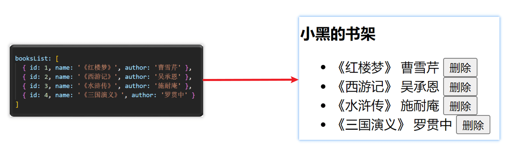

准备代码：

```js
<div id="app">
    <h3>小黑的书架</h3>
    <ul>
      <li>
        <span>《红楼梦》</span>
        <span>曹雪芹</span>
        <button>删除</button>
      </li>
    </ul>
  </div>
  <script src="https://cdn.jsdelivr.net/npm/vue@2/dist/vue.js"></script>
  <script>
    const app = new Vue({
      el: '#app',
      data: {
        booksList: [
          { id: 1, name: '《红楼梦》', author: '曹雪芹' },
          { id: 2, name: '《西游记》', author: '吴承恩' },
          { id: 3, name: '《水浒传》', author: '施耐庵' },
          { id: 4, name: '《三国演义》', author: '罗贯中' }
        ]
      }
    })
  </script>
```


## 十五、v-for中的key

**语法：** key="唯一值"

**作用：**给列表项添加的**唯一标识**。便于Vue进行列表项的**正确排序复用**。

**为什么加key：**Vue 的默认行为会尝试原地修改元素（**就地复用**）

实例代码：

```js
<ul>
  <li v-for="(item, index) in booksList" :key="item.id">
    <span>{{ item.name }}</span>
    <span>{{ item.author }}</span>
    <button @click="del(item.id)">删除</button>
  </li>
</ul>
```

注意：

1.  key 的值只能是字符串 或 数字类型
2. key 的值必须具有唯一性
3. 推荐使用  id 作为 key（唯一），不推荐使用 index 作为 key（会变化，不对应）


## 十六、双向绑定指令

所谓双向绑定就是：

1. 数据改变后，呈现的页面结果会更新
2. 页面结果更新后，数据也会随之而变

**作用：** 给**表单元素**（input、radio、select）使用，双向绑定数据，可以快速 **获取** 或 **设置** 表单元素内容

**语法：**v-model="变量"

**需求：**使用双向绑定实现以下需求

1. 点击登录按钮获取表单中的内容
2. 点击重置按钮清空表单中的内容

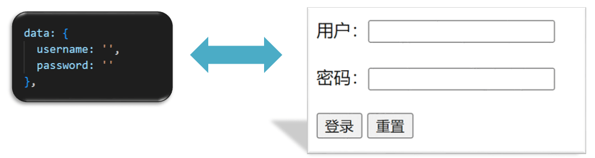


```js
<div id="app">
    账户：<input type="text"> <br><br>
    密码：<input type="password"> <br><br>
    <button>登录</button>
    <button>重置</button>
  </div>
  <script src="https://cdn.jsdelivr.net/npm/vue@2/dist/vue.js"></script>
  <script>
    const app = new Vue({
      el: '#app',
      data: {
        username: '',
        password: ''
      },
    })
  </script>
```


## 十七、综合案例-小黑记事本

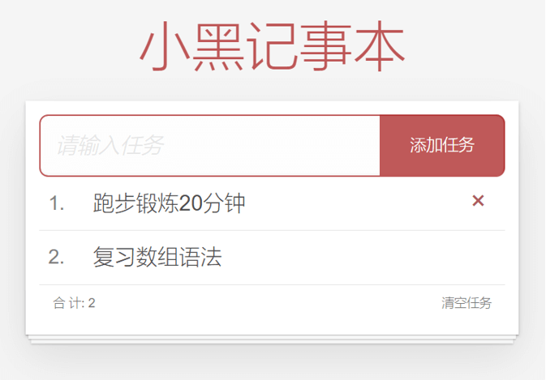

**功能需求：**

1. 列表渲染

2. 删除功能

3. 添加功能

4. 底部统计 和 清空


