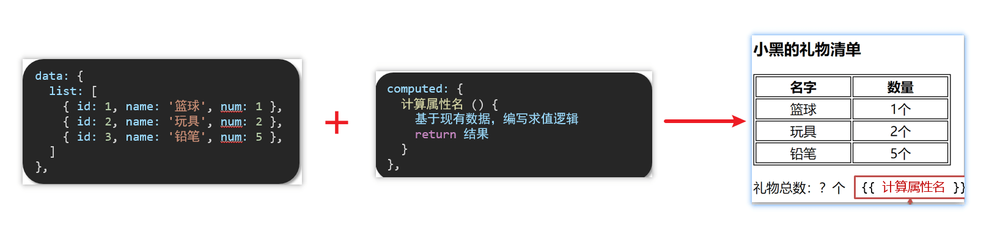
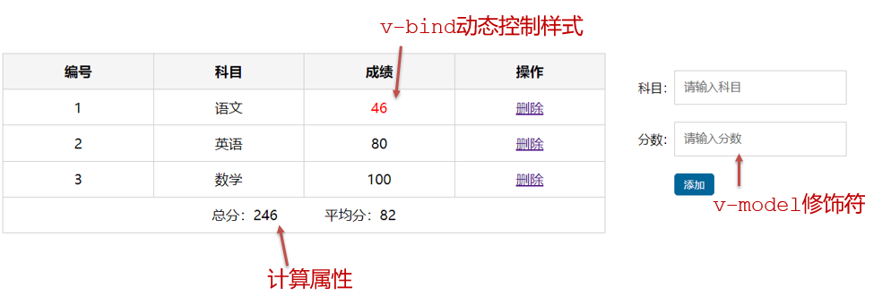
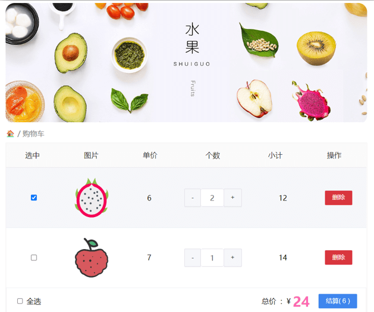

# day02

## 一、今日学习目标

### 1.指令补充

1. 指令修饰符
2. v-bind对样式增强的操作
3. v-model应用于其他表单元素

### 2.computed计算属性

1. 基础语法
2. 计算属性vs方法
3. 计算属性的完整写法
4. 成绩案例

### 3.watch侦听器

1. 基础写法
2. 完整写法

### 4.综合案例 （演示）

1. 渲染  /  删除  /  修改数量 / 全选 / 反选 / 统计总价 /  持久化


## 二、指令修饰符

### 1.什么是指令修饰符？

​	所谓指令修饰符就是通过“.”指明一些指令**后缀** 不同的**后缀**封装了不同的处理操作  —> 简化代码

### 2.按键修饰符

- @keyup.enter  —>当点击enter键的时候才触发

代码演示：

```js
  <div id="app">
    <h3>@keyup.enter  →  监听键盘回车事件</h3>
    <input v-model="username" type="text">
  </div>
  <script src="https://cdn.jsdelivr.net/npm/vue@2/dist/vue.js"></script>
  <script>
    const app = new Vue({
      el: '#app',
      data: {
        username: ''
      },
      methods: {
        
      }
    })
  </script>
```

### 3.v-model修饰符

- v-model.trim  —>去除首位空格
- v-model.number —>转数字

### 4.事件修饰符

- @事件名.stop —> 阻止冒泡
- @事件名.prevent  —>阻止默认行为
- @事件名.stop.prevent —>可以连用 即阻止事件冒泡也阻止默认行为

```js
 <style>
    .father {
      width: 200px;
      height: 200px;
      background-color: pink;
      margin-top: 20px;
    }
    .son {
      width: 100px;
      height: 100px;
      background-color: skyblue;
    }
  </style>

 <div id="app">
    <h3>v-model修饰符 .trim .number</h3>
    姓名：<input v-model="username" type="text"><br>
    年纪：<input v-model="age" type="text"><br>

    
    <h3>@事件名.stop     →  阻止冒泡</h3>
    <div @click="fatherFn" class="father">
      <div @click="sonFn" class="son">儿子</div>
    </div>

    <h3>@事件名.prevent  →  阻止默认行为</h3>
    <a @click href="http://www.baidu.com">阻止默认行为</a>
  </div>

  <script src="https://cdn.jsdelivr.net/npm/vue@2/dist/vue.js"></script>
  <script>
    const app = new Vue({
      el: '#app',
      data: {
        username: '',
        age: '',
      },
      methods: {
        fatherFn () {
          alert('老父亲被点击了')
        },
        sonFn (e) {
          // e.stopPropagation()
          alert('儿子被点击了')
        }
      }
    })
  </script>
```


## 三、v-bind对样式控制的增强-操作class

为了方便开发者进行样式控制， Vue 扩展了 v-bind 的语法，可以针对 **class 类名** 和 **style 行内样式** 进行控制 。

### 1.语法：

```html
<div> :class = "对象/数组">这是一个div</div>
```


### 2.对象语法

当class动态绑定的是**对象**时，**键就是类名，值就是布尔值**，如果值是**true**，就有这个类，否则没有这个类

```html
<div class="box" :class="{ 类名1: 布尔值, 类名2: 布尔值 }"></div>
```

​    适用场景：一个类名，来回切换


### 3.数组语法

当class动态绑定的是**数组**时 → 数组中所有的类，都会添加到盒子上，本质就是一个 class 列表

```html
<div class="box" :class="[ 类名1, 类名2, 类名3 ]"></div>
```

   使用场景:批量添加或删除类


### 4.代码练习

```html
 <style>
    .box {
      width: 200px;
      height: 200px;
      border: 3px solid #000;
      font-size: 30px;
      margin-top: 10px;
    }
    .pink {
      background-color: pink;
    }
    .big {
      width: 300px;
      height: 300px;
    }
  </style>


<div id="app">
    <!--绑定对象-->
    <div class="box">黑马程序员</div>
    <!--绑定数组-->
    <div class="box">黑马程序员</div>
  </div>
  <script src="https://cdn.jsdelivr.net/npm/vue@2/dist/vue.js"></script>
  <script>
    const app = new Vue({
      el: '#app',
      data: {

      }
    })
  </script>
```


## 四、京东秒杀-tab栏切换导航高亮

### 1.需求：

​	当我们点击哪个tab页签时，哪个tab页签就高亮

### 2.准备代码:

```html
 <style>
    * {
      margin: 0;
      padding: 0;
    }
    ul {
      display: flex;
      border-bottom: 2px solid #e01222;
      padding: 0 10px;
    }
    li {
      width: 100px;
      height: 50px;
      line-height: 50px;
      list-style: none;
      text-align: center;
    }
    li a {
      display: block;
      text-decoration: none;
      font-weight: bold;
      color: #333333;
    }
    li a.active {
      background-color: #e01222;
      color: #fff;
    }

  </style>

<div id="app">
    <ul>
      <li><a class="active" href="#">京东秒杀</a></li>
      <li><a href="#">每日特价</a></li>
      <li><a href="#">品类秒杀</a></li>
    </ul>
  </div>
  <script src="https://cdn.jsdelivr.net/npm/vue@2/dist/vue.js"></script>
  <script>
    const app = new Vue({
      el: '#app',
      data: {
        list: [
          { id: 1, name: '京东秒杀' },
          { id: 2, name: '每日特价' },
          { id: 3, name: '品类秒杀' }
        ]
      }
    })
  </script>
```

### 3.思路：

1.基于数据，动态渲染tab（v-for）

2.准备一个下标 记录高亮的是哪一个 tab

3.基于下标动态切换class的类名


## 五、v-bind对有样式控制的增强-操作style

### 1.语法

```html
<div class="box" :style="{ CSS属性名1: CSS属性值, CSS属性名2: CSS属性值 }"></div>
```

### 2.代码练习

```html
<style>
    .box {
      width: 200px;
      height: 200px;
      background-color: rgb(187, 150, 156);
    }
 </style>
 <div id="app">
    <div class="box" :style="{ width: '400px', height: '400px', backgroundColor: 'green' }"></div>
  </div>
  <script src="https://cdn.jsdelivr.net/npm/vue@2/dist/vue.js"></script>
  <script>
    const app = new Vue({
      el: '#app',
      data: {

      }
    })
  </script>
```

### 3.进度条案例

```html
 <style>
    .progress {
      height: 25px;
      width: 400px;
      border-radius: 15px;
      background-color: #272425;
      border: 3px solid #272425;
      box-sizing: border-box;
      margin-bottom: 30px;
    }
    .inner {
      width: 50%;
      height: 20px;
      border-radius: 10px;
      text-align: right;
      position: relative;
      background-color: #409eff;
      background-size: 20px 20px;
      box-sizing: border-box;
      transition: all 1s;
    }
    .inner span {
      position: absolute;
      right: -20px;
      bottom: -25px;
    }
  </style>

<div id="app">
    <div class="progress">
      <div class="inner">
        <span>50%</span>
      </div>
    </div>
    <button>设置25%</button>
    <button>设置50%</button>
    <button>设置75%</button>
    <button>设置100%</button>
  </div>

  <script src="https://cdn.jsdelivr.net/npm/vue@2/dist/vue.js"></script>
  <script>
    const app = new Vue({
      el: '#app',
      data: {

      }
    })
  </script>
```


## 六、v-model在其他表单元素的使用

### 1.讲解内容：

常见的表单元素都可以用 v-model 绑定关联  →  快速 **获取** 或 **设置** 表单元素的值

它会根据  **控件类型** 自动选取  **正确的方法** 来更新元素

```js
输入框  input:text   ——> value
文本域  textarea	 ——> value
复选框  input:checkbox  ——> checked
单选框  input:radio   ——> checked
下拉菜单 select    ——> value
...
```

### 2.代码准备

```html
 <style>
    textarea {
      display: block;
      width: 240px;
      height: 100px;
      margin: 10px 0;
    }
  </style>
 <div id="app">
    <h3>小黑学习网</h3>
    姓名：
      <input type="text"> 
      <br><br>
    是否单身：
      <input type="checkbox"> 
      <br><br>
    <!-- 
      前置理解：
        1. name:  给单选框加上 name 属性 可以分组 → 同一组互相会互斥
        2. value: 给单选框加上 value 属性，用于提交给后台的数据
      结合 Vue 使用 → v-model
    -->
    性别: 
      <input type="radio">男
      <input type="radio">女
      <br><br>
    <!-- 
      前置理解：
        1. option 需要设置 value 值，提交给后台
        2. select 的 value 值，关联了选中的 option 的 value 值
      结合 Vue 使用 → v-model
    -->
    所在城市:
      <select>
        <option>北京</option>
        <option>上海</option>
        <option>成都</option>
        <option>南京</option>
      </select>
      <br><br>
    自我描述：
      <textarea></textarea> 
    <button>立即注册</button>
  </div>
  <script src="https://cdn.jsdelivr.net/npm/vue@2/dist/vue.js"></script>
  <script>
    const app = new Vue({
      el: '#app',
      data: {

      }
    })
  </script>
```


## 七、computed计算属性

### 1.概念

基于**现有的数据**，计算出来的**新属性**。 **依赖**的数据变化，**自动**重新计算。

### 2.语法

1. 声明在 **computed 配置项**中，一个计算属性对应一个函数
2. 使用起来和普通属性一样使用  {{ 计算属性名}}  

### 3.注意

1. computed配置项和data配置项是**同级**的
2. computed中的计算属性**虽然是函数的写法**，但他**依然是个属性**
3. computed中的计算属性**不能**和data中的属性**同名**
4. 使用computed中的计算属性和使用data中的属性是一样的用法
5. computed中计算属性内部的**this**依然**指向的是Vue实例**

#### 4.案例

比如我们可以使用计算属性实现下面这个业务场景



### 5.代码准备

```html
<style>
    table {
      border: 1px solid #000;
      text-align: center;
      width: 240px;
    }
    th,td {
      border: 1px solid #000;
    }
    h3 {
      position: relative;
    }
  </style>

<div id="app">
    <h3>小黑的礼物清单</h3>
    <table>
      <tr>
        <th>名字</th>
        <th>数量</th>
      </tr>
      <tr v-for="(item, index) in list" :key="item.id">
        <td>{{ item.name }}</td>
        <td>{{ item.num }}个</td>
      </tr>
    </table>

    <!-- 目标：统计求和，求得礼物总数 -->
    <p>礼物总数：? 个</p>
  </div>
  <script src="https://cdn.jsdelivr.net/npm/vue@2/dist/vue.js"></script>
  <script>
    const app = new Vue({
      el: '#app',
      data: {
        // 现有的数据
        list: [
          { id: 1, name: '篮球', num: 1 },
          { id: 2, name: '玩具', num: 2 },
          { id: 3, name: '铅笔', num: 5 },
        ]
      }
    })
  </script>
```


## 八、computed计算属性 VS methods方法

### 1.computed计算属性

作用：封装了一段对于**数据**的处理，求得一个**结果**

语法：

1. 写在computed配置项中
2. 作为属性，直接使用
   - js中使用计算属性： this.计算属性
   - 模板中使用计算属性：{{计算属性}}


### 2.methods计算属性

作用：给Vue实例提供一个**方法**，调用以**处理业务逻辑**。

语法：

1. 写在methods配置项中
2. 作为方法调用
   - js中调用：this.方法名()
   - 模板中调用 {{方法名()}}  或者 @事件名=“方法名”


### 3.计算属性的优势

1. 缓存特性（提升性能）

   计算属性会对计算出来的结果缓存，再次使用直接读取缓存，

   依赖项变化了，会自动重新计算 → 并再次缓存

2. methods没有缓存特性

3. 通过代码比较

```html
<style>
    table {
      border: 1px solid #000;
      text-align: center;
      width: 300px;
    }
    th,td {
      border: 1px solid #000;
    }
    h3 {
      position: relative;
    }
    span {
      position: absolute;
      left: 145px;
      top: -4px;
      width: 16px;
      height: 16px;
      color: white;
      font-size: 12px;
      text-align: center;
      border-radius: 50%;
      background-color: #e63f32;
    }
  </style>

<div id="app">
    <h3>小黑的礼物清单🛒<span>?</span></h3>
    <table>
      <tr>
        <th>名字</th>
        <th>数量</th>
      </tr>
      <tr v-for="(item, index) in list" :key="item.id">
        <td>{{ item.name }}</td>
        <td>{{ item.num }}个</td>
      </tr>
    </table>

    <p>礼物总数：{{ totalCount }} 个</p>
  </div>
  <script src="https://cdn.jsdelivr.net/npm/vue@2/dist/vue.js"></script>
  <script>
    const app = new Vue({
      el: '#app',
      data: {
        // 现有的数据
        list: [
          { id: 1, name: '篮球', num: 3 },
          { id: 2, name: '玩具', num: 2 },
          { id: 3, name: '铅笔', num: 5 },
        ]
      },
      computed: {
        totalCount () {
          let total = this.list.reduce((sum, item) => sum + item.num, 0)
          return total
        }
      }
    })
  </script>
```

### 4.总结

1.computed**有缓存特性**，methods**没有缓存**

2.当一个结果依赖其他多个值时，推荐使用计算属性

3.当处理业务逻辑时，推荐使用methods方法，比如事件的处理函数


## 九、计算属性的完整写法

**既然计算属性也是属性，能访问，应该也能修改了？**

1. 计算属性默认的简写，只能读取访问，不能 "修改"
2. 如果要 "修改"  → 需要写计算属性的完整写法


完整写法代码演示

```html
 <div id="app">
    姓：<input type="text" v-model="firstName"> +
    名：<input type="text" v-model="lastName"> =
    <span></span><br><br> 
    <button>改名卡</button>
  </div>
  <script src="https://cdn.jsdelivr.net/npm/vue@2/dist/vue.js"></script>
  <script>
    const app = new Vue({
      el: '#app',
      data: {
 		firstName: '刘',
        lastName: '备'
      },
      computed: {

      },
      methods: {

      }
    })
  </script>
```


## 十、综合案例-成绩案例



功能描述：

1.渲染功能

2.删除功能

3.添加功能

4.统计总分，求平均分


思路分析：

1.渲染功能  v-for  :key  v-bind:动态绑定class的样式

2.删除功能 v-on绑定事件， 阻止a标签的默认行为

3.v-model的修饰符 .trim、 .number、  判断数据是否为空后 再添加、添加后清空文本框的数据

4.使用计算属性computed 计算总分和平均分的值


## 十一、watch侦听器（监视器）

### 1.作用：

​	**监视数据变化**，执行一些业务逻辑或异步操作

### 2.语法：

1. watch同样声明在跟data同级的配置项中

2. 简单写法： 简单类型数据直接监视

3. 完整写法：添加额外配置项

   ```js
   data: { 
     words: '苹果',
     obj: {
       words: '苹果'
     }
   },

   watch: {
     // 该方法会在数据变化时，触发执行
     数据属性名 (newValue, oldValue) {
       一些业务逻辑 或 异步操作。 
     },
     '对象.属性名' (newValue, oldValue) {
       一些业务逻辑 或 异步操作。 
     }
   }
   ```

### 3.侦听器代码准备

```html
 <style>
      * {
        margin: 0;
        padding: 0;
        box-sizing: border-box;
        font-size: 18px;
      }
      #app {
        padding: 10px 20px;
      }
      .query {
        margin: 10px 0;
      }
      .box {
        display: flex;
      }
      textarea {
        width: 300px;
        height: 160px;
        font-size: 18px;
        border: 1px solid #dedede;
        outline: none;
        resize: none;
        padding: 10px;
      }
      textarea:hover {
        border: 1px solid #1589f5;
      }
      .transbox {
        width: 300px;
        height: 160px;
        background-color: #f0f0f0;
        padding: 10px;
        border: none;
      }
      .tip-box {
        width: 300px;
        height: 25px;
        line-height: 25px;
        display: flex;
      }
      .tip-box span {
        flex: 1;
        text-align: center;
      }
      .query span {
        font-size: 18px;
      }

      .input-wrap {
        position: relative;
      }
      .input-wrap span {
        position: absolute;
        right: 15px;
        bottom: 15px;
        font-size: 12px;
      }
      .input-wrap i {
        font-size: 20px;
        font-style: normal;
      }
    </style>

 <div id="app">
      <!-- 条件选择框 -->
      <div class="query">
        <span>翻译成的语言：</span>
        <select>
          <option value="italy">意大利</option>
          <option value="english">英语</option>
          <option value="german">德语</option>
        </select>
      </div>

      <!-- 翻译框 -->
      <div class="box">
        <div class="input-wrap">
          <textarea v-model="words"></textarea>
          <span><i>⌨️</i>文档翻译</span>
        </div>
        <div class="output-wrap">
          <div class="transbox">mela</div>
        </div>
      </div>
    </div>
    <script src="https://cdn.jsdelivr.net/npm/vue@2/dist/vue.js"></script>
    <script src="https://cdn.jsdelivr.net/npm/axios/dist/axios.min.js"></script>
    <script>
      // 接口地址：https://applet-base-api-t.itheima.net/api/translate
      // 请求方式：get
      // 请求参数：
      // （1）words：需要被翻译的文本（必传）
      // （2）lang： 需要被翻译成的语言（可选）默认值-意大利
      // -----------------------------------------------
      
      const app = new Vue({
        el: '#app',
        data: {
          words: ''
        },
        // 具体讲解：(1) watch语法 (2) 具体业务实现
      })
    </script>
```


## 十二、翻译案例-代码实现

```js
  <script>
      // 接口地址：https://applet-base-api-t.itheima.net/api/translate
      // 请求方式：get
      // 请求参数：
      // （1）words：需要被翻译的文本（必传）
      // （2）lang： 需要被翻译成的语言（可选）默认值-意大利
      // -----------------------------------------------
      
      const app = new Vue({
        el: '#app',
        data: {
           //words: ''
           obj: {
            words: ''
          },
          result: '', // 翻译结果
          // timer: null // 延时器id
        },
        // 具体讲解：(1) watch语法 (2) 具体业务实现
        watch: {
          // 该方法会在数据变化时调用执行
          // newValue新值, oldValue老值（一般不用）
          // words (newValue) {
          //   console.log('变化了', newValue)
          // }

          'obj.words' (newValue) {
            // console.log('变化了', newValue)
            // 防抖: 延迟执行 → 干啥事先等一等，延迟一会，一段时间内没有再次触发，才执行
            clearTimeout(this.timer)
            this.timer = setTimeout(async () => {
              const res = await axios({
                url: 'https://applet-base-api-t.itheima.net/api/translate',
                params: {
                  words: newValue
                }
              })
              this.result = res.data.data
              console.log(res.data.data)
            }, 300)
          }
        }
      })
    </script>
```


## 十三、watch侦听器

### 1.语法

完整写法 —>添加额外的配置项

1. deep:true 对复杂类型进行深度监听
2. immdiate:true 初始化 立刻执行一次

```js
data: {
  obj: {
    words: '苹果',
    lang: 'italy'
  },
},

watch: {// watch 完整写法
  对象: {
    deep: true, // 深度监视
    immdiate:true,//立即执行handler函数
    handler (newValue) {
      console.log(newValue)
    }
  }
}

```

### 2.需求


- 当文本框输入的时候 右侧翻译内容要时时变化
- 当下拉框中的语言发生变化的时候 右侧翻译的内容依然要时时变化
- 如果文本框中有默认值的话要立即翻译

### 3.代码实现

```js
 <script> 
      const app = new Vue({
        el: '#app',
        data: {
          obj: {
            words: '小黑',
            lang: 'italy'
          },
          result: '', // 翻译结果
        },
        watch: {
          obj: {
            deep: true, // 深度监视
            immediate: true, // 立刻执行，一进入页面handler就立刻执行一次
            handler (newValue) {
              clearTimeout(this.timer)
              this.timer = setTimeout(async () => {
                const res = await axios({
                  url: 'https://applet-base-api-t.itheima.net/api/translate',
                  params: newValue
                })
                this.result = res.data.data
                console.log(res.data.data)
              }, 300)
            }
          } 
        }
      })
    </script>
```

### 4.总结

watch侦听器的写法有几种？

1.简单写法

```js
watch: {
  数据属性名 (newValue, oldValue) {
    一些业务逻辑 或 异步操作。 
  },
  '对象.属性名' (newValue, oldValue) {
    一些业务逻辑 或 异步操作。 
  }
}
```

2.完整写法

```js
watch: {// watch 完整写法
  数据属性名: {
    deep: true, // 深度监视(针对复杂类型)
    immediate: true, // 是否立刻执行一次handler
    handler (newValue) {
      console.log(newValue)
    }
  }
}
```


## 十四、综合案例

购物车案例




需求说明：

1. 渲染功能
2. 删除功能
3. 修改个数
4. 全选反选
5. 统计 选中的 总价 和 总数量 
6. 持久化到本地


实现思路：

1.基本渲染：  v-for遍历、:class动态绑定样式

2.删除功能 ： v-on 绑定事件，获取当前行的id

3.修改个数 ： v-on绑定事件，获取当前行的id，进行筛选出对应的项然后增加或减少

4.全选反选 

1. 必须所有的小选框都选中，全选按钮才选中 → every
2. 如果全选按钮选中，则所有小选框都选中
3. 如果全选取消，则所有小选框都取消选中

声明计算属性，判断数组中的每一个checked属性的值，看是否需要全部选

5.统计 选中的 总价 和 总数量 ：通过计算属性来计算**选中的**总价和总数量

6.持久化到本地： 在数据变化时都要更新下本地存储 watch


