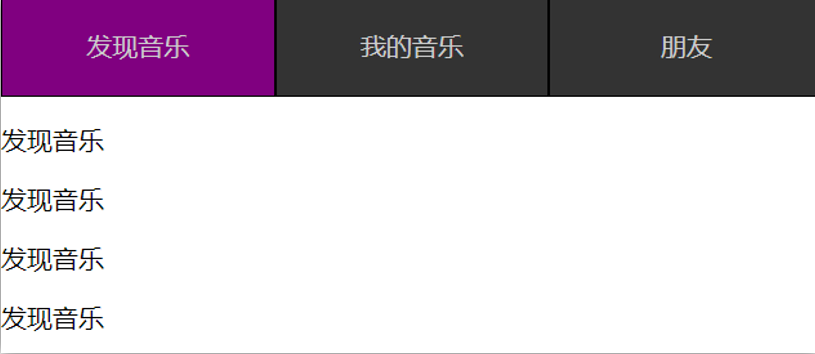
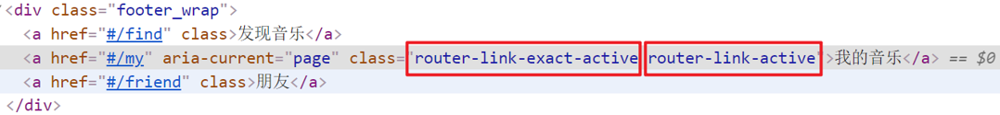
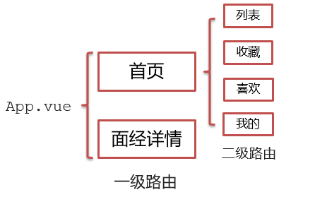

# day06

## 一、声明式导航-导航链接

### 1.需求

实现导航高亮效果



如果使用a标签进行跳转的话，需要给当前跳转的导航加样式，同时要移除上一个a标签的样式，太麻烦！！！

### 2.解决方案

vue-router 提供了一个全局组件 router-link (取代 a 标签)

- **能跳转**，配置 to 属性指定路径(**必须**) 。本质还是 a 标签 ，**to 无需 #**
- **能高亮**，默认就会提供**高亮类名**，可以直接设置高亮样式

语法： <router-link to="path的值">发现音乐</router-link>

```vue
  <div>
    <div class="footer_wrap">
      <router-link to="/find">发现音乐</router-link>
      <router-link to="/my">我的音乐</router-link>
      <router-link to="/friend">朋友</router-link>
    </div>
    <div class="top">
      <!-- 路由出口 → 匹配的组件所展示的位置 -->
      <router-view></router-view>
    </div>
  </div>
```

### 3.通过router-link自带的两个样式进行高亮

使用router-link跳转后，我们发现。当前点击的链接默认加了两个class的值 `router-link-exact-active`和`router-link-active`

我们可以给任意一个class属性添加高亮样式即可实现功能


### 4.总结

- router-link是什么？
- router-link怎么用？
- router-link的好处是什么？


## 二、声明式导航-两个类名

当我们使用<router-link></router-link>跳转时，自动给当前导航加了**两个类名**


### 1.router-link-active

**模糊匹配（用的多）**

to="/my"  可以匹配 /my    /my/a    /my/b    ....  

只要是以/my开头的路径 都可以和 to="/my"匹配到


### 2.router-link-exact-active

**精确匹配**

to="/my" 仅可以匹配  /my


### 3.在地址栏中输入二级路由查看类名的添加


### 4.总结

- router-link 会自动给当前导航添加两个类名，有什么区别呢？


## 三、声明式导航-自定义类名（了解）

### 1.问题

router-link的**两个高亮类名 太长了**，我们希望能定制怎么办



### 2.解决方案

我们可以在创建路由对象时，额外配置两个配置项即可。 `linkActiveClass`和`linkExactActiveClass`

```js
const router = new VueRouter({
  routes: [...],
  linkActiveClass: "类名1",
  linkExactActiveClass: "类名2"
})
```


### 3.代码演示

```js
// 创建了一个路由对象
const router = new VueRouter({
  routes: [
    ...
  ], 
  linkActiveClass: 'active', // 配置模糊匹配的类名
  linkExactActiveClass: 'exact-active' // 配置精确匹配的类名
})
```


### 4.总结

如何自定义router-link的两个**高亮类名**


## 四、声明式导航-查询参数传参

### 1.目标

在跳转路由时，进行传参


比如：现在我们在搜索页点击了热门搜索链接，跳转到详情页，**需要把点击的内容带到详情页**，改怎么办呢？

### 2.跳转传参

我们可以通过两种方式，在跳转的时候把所需要的参数传到其他页面中

- 查询参数传参
- 动态路由传参


### 3.查询参数传参

- 如何传参？

  <router-link to="/path?参数名=值"></router-link>

- 如何接受参数

  固定用法：$router.query.参数名


### 4.代码演示

App.vue

```vue
<template>
  <div id="app">
    <div class="link">
      <router-link to="/home">首页</router-link>
      <router-link to="/search">搜索页</router-link>
    </div>

    <router-view></router-view>
  </div>
</template>

<script>
export default {};
</script>

<style scoped>
.link {
  height: 50px;
  line-height: 50px;
  background-color: #495150;
  display: flex;
  margin: -8px -8px 0 -8px;
  margin-bottom: 50px;
}
.link a {
  display: block;
  text-decoration: none;
  background-color: #ad2a26;
  width: 100px;
  text-align: center;
  margin-right: 5px;
  color: #fff;
  border-radius: 5px;
}
</style>
```

Home.vue

```vue
<template>
  <div class="home">
    <div class="logo-box"></div>
    <div class="search-box">
      <input type="text">
      <button>搜索一下</button>
    </div>
    <div class="hot-link">
      热门搜索：
      <router-link to="">黑马程序员</router-link>
      <router-link to="">前端培训</router-link>
      <router-link to="">如何成为前端大牛</router-link>
    </div>
  </div>
</template>

<script>
export default {
  name: 'FindMusic'
}
</script>

<style>
.logo-box {
  height: 150px;
  background: url('@/assets/logo.jpeg') no-repeat center;
}
.search-box {
  display: flex;
  justify-content: center;
}
.search-box input {
  width: 400px;
  height: 30px;
  line-height: 30px;
  border: 2px solid #c4c7ce;
  border-radius: 4px 0 0 4px;
  outline: none;
}
.search-box input:focus {
  border: 2px solid #ad2a26;
}
.search-box button {
  width: 100px;
  height: 36px;
  border: none;
  background-color: #ad2a26;
  color: #fff;
  position: relative;
  left: -2px;
  border-radius: 0 4px 4px 0;
}
.hot-link {
  width: 508px;
  height: 60px;
  line-height: 60px;
  margin: 0 auto;
}
.hot-link a {
  margin: 0 5px;
}
</style>
```

Search.vue

```vue
<template>
  <div class="search">
    <p>搜索关键字: 黑马程序员</p>
    <p>搜索结果: </p>
    <ul>
      <li>.............</li>
      <li>.............</li>
      <li>.............</li>
      <li>.............</li>
    </ul>
  </div>
</template>

<script>
export default {
  name: 'MyFriend',
  created () {
    // 在created中，获取路由参数
  }
}
</script>

<style>
.search {
  width: 400px;
  height: 240px;
  padding: 0 20px;
  margin: 0 auto;
  border: 2px solid #c4c7ce;
  border-radius: 5px;
}
</style>
```

router/index.js

```js
import Home from '@/views/Home'
import Search from '@/views/Search'
import Vue from 'vue'
import VueRouter from 'vue-router'
Vue.use(VueRouter) // VueRouter插件初始化

// 创建了一个路由对象
const router = new VueRouter({
  routes: [
    { path: '/home', component: Home },
    { path: '/search', component: Search }
  ]
})

export default router
```

main.js

```
...
import router from './router/index'
...
new Vue({
  render: h => h(App),
  router
}).$mount('#app')
```


## 五、声明式导航-动态路由传参

### 1.动态路由传参方式

- 配置动态路由

  > 动态路由后面的参数可以随便起名，但要有语义

  ```js
  const router = new VueRouter({
    routes: [
      ...,
      { 
        path: '/search/:words', 
        component: Search 
      }
    ]
  })
  ```

- 配置导航链接

  to="/path/参数值"

- 对应页面组件**接受参数**

  $route.**params**.参数名

  > params后面的参数名要和动态路由配置的参数保持一致


### 2.查询参数传参 VS 动态路由传参

1.  查询参数传参  (比较适合传**多个参数**) 

   1. 跳转：to="/path?参数名=值&参数名2=值"
   2. 获取：$route.query.参数名

2. 动态路由传参 (**优雅简洁**，传单个参数比较方便)

   1. 配置动态路由：path: "/path/:参数名" 
   2. 跳转：to="/path/参数值"
   3. 获取：$route.params.参数名 

   注意：动态路由也可以传多个参数，但一般只传一个

### 3.总结

声明式导航跳转时, 有几种方式传值给路由页面？

- 查询参数传参（多个参数）
- 动态路由传参（一个参数，优雅简洁）

 

## 六、动态路由参数的可选符(了解)

### 1.问题

配了路由 path:"/search/:words"  为什么按下面步骤操作，会未匹配到组件，显示空白？


### 2.原因

/search/:words  表示，**必须要传参数**。如果不传参数，也希望匹配，可以加个可选符"？"

```js
const router = new VueRouter({
  routes: [
 	...
    { path: '/search/:words?', component: Search }
  ]
})
```


## 七、Vue路由-重定向

### 1.问题

网页打开时， url 默认是 / 路径，未匹配到组件时，会出现空白


### 2.解决方案

**重定向** → 匹配 / 后, 强制跳转 /home 路径


### 3.语法

```js
{ path: 匹配路径, redirect: 重定向到的路径 },
比如：
{ path:'/' ,redirect:'/home' }
```


### 4.代码演示

```
const router = new VueRouter({
  routes: [
    { path: '/', redirect: '/home'},
 	 ...
  ]
})
```


## 八、Vue路由-404

### 1.作用

当路径找不到匹配时，给个提示页面

### 2.位置

404的路由，虽然配置在任何一个位置都可以，但一般都**配置在其他路由规则的最后面**

### 3.语法

path: "*"   (任意路径) – 前面不匹配就命中最后这个

```js
import NotFind from '@/views/NotFind'

const router = new VueRouter({
  routes: [
    ...
    { path: '*', component: NotFind } //最后一个
  ]
})
```

### 4.代码示例

NotFound.vue

```vue
<template>
  <div>
    <h1>404 Not Found</h1>
  </div>
</template>

<script>
export default {

}
</script>

<style>

</style>
```

router/index.js

```js
...
import NotFound from '@/views/NotFound'
...

// 创建了一个路由对象
const router = new VueRouter({
  routes: [
     ...
    { path: '*', component: NotFound }
  ]
})

export default router
```


## 九、Vue路由-模式设置

### 1.问题

路由的路径看起来不自然, 有#，能否切成真正路径形式?

- hash路由(默认)        例如:  http://localhost:8080/#/home
- history路由(常用)     例如: http://localhost:8080/home   (以后上线需要服务器端支持，开发环境webpack给规避掉了history模式的问题)

### 2.语法

```js
const router = new VueRouter({
    mode:'histroy', //默认是hash
    routes:[]
})
```


## 十、编程式导航-两种路由跳转方式

### 1.问题

点击按钮跳转如何实现？


### 2.方案

编程式导航：用JS代码来进行跳转

### 3.语法

两种语法：

- path 路径跳转 （简易方便）
- name 命名路由跳转 (适合 path 路径长的场景)

### 4.path路径跳转语法

特点：简易方便

```js
//简单写法
this.$router.push('路由路径')

//完整写法
this.$router.push({
  path: '路由路径'
})
```

### 5.代码演示 path跳转方式


### 6.name命名路由跳转

特点：适合 path 路径长的场景

语法：

- 路由规则，必须配置name配置项

  ```js
  { name: '路由名', path: '/path/xxx', component: XXX },
  ```

- 通过name来进行跳转

  ```js
  this.$router.push({
    name: '路由名'
  })
  ```


### 7.代码演示通过name命名路由跳转


### 8.总结

编程式导航有几种跳转方式？


## 十一、编程式导航-path路径跳转传参

### 1.问题

点击搜索按钮，跳转需要把文本框中输入的内容传到下一个页面如何实现？


### 2.两种传参方式

1.查询参数 

2.动态路由传参


### 3.传参

两种跳转方式，对于两种传参方式都支持：

① path 路径跳转传参

② name 命名路由跳转传参


### 4.path路径跳转传参（query传参）

```js
//简单写法
this.$router.push('/路径?参数名1=参数值1&参数2=参数值2')
//完整写法
this.$router.push({
  path: '/路径',
  query: {
    参数名1: '参数值1',
    参数名2: '参数值2'
  }
})
```

接受参数的方式依然是：$route.query.参数名

### 5.path路径跳转传参（动态路由传参）

```
//简单写法
this.$router.push('/路径/参数值')
//完整写法
this.$router.push({
  path: '/路径/参数值'
})
```

接受参数的方式依然是：$route.params.参数值

**注意：**path不能配合params使用


## 十二、编程式导航-name命名路由传参

### 1.name 命名路由跳转传参 (query传参)

```js
this.$router.push({
  name: '路由名字',
  query: {
    参数名1: '参数值1',
    参数名2: '参数值2'
  }
})
```

### 2.name 命名路由跳转传参 (动态路由传参)

```js
this.$router.push({
  name: '路由名字',
  params: {
    参数名: '参数值',
  }
})
```

### 3.总结

编程式导航，如何跳转传参？

1.path路径跳转

- query传参

  ```js
  this.$router.push('/路径?参数名1=参数值1&参数2=参数值2')
  this.$router.push({
    path: '/路径',
    query: {
      参数名1: '参数值1',
      参数名2: '参数值2'
    }
  })
  ```

- 动态路由传参

  ```js
  this.$router.push('/路径/参数值')
  this.$router.push({
    path: '/路径/参数值'
  })
  ```

2.name命名路由跳转

- query传参

  ```js
  this.$router.push({
    name: '路由名字',
    query: {
      参数名1: '参数值1',
      参数名2: '参数值2'
    }
  })
  ```

- 动态路由传参 (需要配动态路由)

  ```js
  this.$router.push({
    name: '路由名字',
    params: {
      参数名: '参数值',
    }
  })
  ```

  ​

## 十三、面经基础版-案例效果分析

### 1.面经效果演示

### 2.功能分析

- 通过演示效果发现，主要的功能页面有两个，一个是**列表页**，一个是**详情页**，并且在列表页点击时可以跳转到详情页
- 底部导航可以来回切换，并且切换时，只有上面的主题内容在动态渲染


### 3.实现思路分析：配置路由+功能实现

1.配置路由

- 首页和面经详情页，两个一级路由
- 首页内嵌套4个可切换的页面（嵌套二级路由）

2.实现功能

- 首页请求渲染
- **跳转传参** 到 详情页，详情页动态渲染
- 组件缓存，性能优化



## 十四、面经基础版-一级路由配置

1.把文档中准备的素材拷贝到项目中

2.针对router/index.js文件 进行一级路由配置

```js
...
import Layout from '@/views/Layout.vue'
import ArticleDetail from '@/views/ArticleDetail.vue'
...


const router = new VueRouter({
  routes: [
    {
      path: '/',
      redirect: '/home'
    },
    {
      path: '/home',
      component: Layout
    },
    {
      path: '/detail',
      component: ArticleDetail
    }
  ]
})
```


## 十五、面经基础版-二级路由配置

二级路由也叫嵌套路由，当然也可以嵌套三级、四级...

### 1.使用场景

当在页面中点击链接跳转，只是部分内容切换时，我们可以使用嵌套路由

### 2.语法

- 在一级路由下，配置children属性即可
- 配置二级路由的出口


 1.在一级路由下，配置children属性

 **注意**:一级的路由path 需要加 `/`   二级路由的path不需要加 `/`

```js
const router = new VueRouter({
  routes: [
    {
      path: '/home',
      component: Layout,
      children:[
        //children中的配置项 跟一级路由中的配置项一模一样 
        {path:'xxxx',component:xxxx.vue},
        {path:'xxxx',component:xxxx.vue},
      ]
    }
  ]
})
```

技巧：二级路由应该配置到哪个一级路由下呢？

**这些二级路由对应的组件渲染到哪个一级路由下，children就配置到哪个路由下边**


2.配置二级路由的出口 <router-view></router-view>

**注意：** 配置了嵌套路由，一定配置对应的路由出口，否则不会渲染出对应的组件

Layout.vue

```vue
<template>
  <div class="h5-wrapper">
    <div class="content">
      <router-view></router-view>
    </div>
  ....
  </div>
</template>
```

### 3.代码实现

router/index.js

```js
...
import Article from '@/views/Article.vue'
import Collect from '@/views/Collect.vue'
import Like from '@/views/Like.vue'
import User from '@/views/User.vue'
...

const router = new VueRouter({
  routes: [
    {
      path: '/',
      redirect: '/home/article'
    },
    {
      path: '/home',
      component: Layout,
      children:[
        {
          path:'article',
          component:Article
        },
        {
          path:'collect',
          component:Collect
        },
        {
          path:'like',
          component:Like
        },
        {
          path:'user',
          component:User
        }
      ]
    },
    ....
  ]
})

```

Layout.vue

```vue
<template>
  <div class="h5-wrapper">
    <div class="content">
      <!-- 内容部分 -->
      <router-view></router-view>
    </div>
    <nav class="tabbar">
      <a href="#/home/article">面经</a>
      <a href="#/home/collect">收藏</a>
      <a href="#/home/like">喜欢</a>
      <a href="#/home/user">我的</a>
    </nav>
  </div>
</template>
```


## 十六、面经基础版-二级导航高亮

### 1.实现思路

- 将a标签替换成 <router-link></router-link>组件，配置to属性，不用加 #
- 结合高亮类名实现高亮效果 (推荐模糊匹配：router-link-active)

### 2.代码实现

Layout.vue

```vue
....
    <nav class="tabbar">
      <router-link to="/home/article">面经</router-link>
      <router-link to="/home/collect">收藏</router-link>
      <router-link to="/home/like">喜欢</router-link>
      <router-link to="/home/user">我的</router-link>
    </nav>

<style>
   a.router-link-active {
      color: orange;
    }
</style>
```


## 十七、面经基础版-首页请求渲染

### 1.步骤分析

1.安装axios 

2.看接口文档，确认请求方式，请求地址，请求参数

3.created中发送请求，获取数据，存储到data中

4.页面动态渲染


### 2.代码实现

1.安装axios

`yarn add axios `  `npm i axios`

2.接口文档

```vue
请求地址: https://mock.boxuegu.com/mock/3083/articles
请求方式: get
```

3.created中发送请求，获取数据，存储到data中

```vue
 data() {
    return {
      articelList: [],
    }
  },
  async created() {
    const {  data: { result: { rows } }} = await axios.get('https://mock.boxuegu.com/mock/3083/articles')
    this.articelList = rows
  },
```

4.页面动态渲染

```vue
<template>
  <div class="article-page">
    <div class="article-item" v-for="item in articelList" :key="item.id">
      <div class="head">
        
        <div class="con">
          <p class="title">{{ item.stem }}</p>
          <p class="other">{{ item.creatorName }} | {{ item.createdAt }}</p>
        </div>
      </div>
      <div class="body">
        {{item.content}}
      </div>
      <div class="foot">点赞 {{item.likeCount}} | 浏览 {{item.views}}</div>
    </div>
  </div>
</template>
```


## 十八、面经基础版-查询参数传参

### 1.说明

跳转详情页需要把当前点击的文章id传给详情页，获取数据

- 查询参数传参  this.$router.push('/detail?参数1=参数值&参数2=参数值') 
- 动态路由传参  先改造路由 在传参  this.$router.push('/detail/参数值')


### 2.查询参数传参实现

Article.vue

```vue
<template>
  <div class="article-page">
    <div class="article-item" 
      v-for="item in articelList" :key="item.id" 
      @click="$router.push(`/detail?id=${item.id}`)">
     ...
    </div>
  </div>
</template>
```

ArticleDetail.vue

```vue
  created(){
    console.log(this.$route.query.id)
  }
```


## 十九、面经基础版-动态路由传参

### 1.实现步骤

- 改造路由
- 动态传参
- 在详情页获取参数

### 2.代码实现

改造路由

router/index.js

```js
...
  {
      path: '/detail/:id',
      component: ArticleDetail
  }
```

Article.vue

```vue
<div class="article-item" 
     v-for="item in articelList" :key="item.id" 
     @click="$router.push(`/detail/${item.id}`)">
       ....
 </div>
```

ArticleDetail.vue

```vue
  created(){
    console.log(this.$route.params.id)
  }
```


### 3.额外优化一个功能-点击回退跳转到上一页

ArticleDetail.vue

```vue
<template>
  <div class="article-detail-page">
    <nav class="nav"><span class="back" @click="$router.back()">&lt;</span> 面经详情</nav>
     ....
  </div>
</template>
```


## 二十、面经基础版-详情页渲染

### 1.实现步骤分析

- 导入axios
- 查看接口文档
- 在created中发送请求
- 页面动态渲染


### 2.代码实现

接口文档

```vue
 请求地址: https://mock.boxuegu.com/mock/3083/articles/:id
 请求方式: get
```


在created中发送请求

```vue
 data() {
    return {
      articleDetail:{}
    }
  },
  async created() {
    const id = this.$route.params.id
    const {data:{result}} = await axios.get(
      `https://mock.boxuegu.com/mock/3083/articles/${id}`
    )
    this.articleDetail = result
  },
```


页面动态渲染

```vue
<template>
  <div class="article-detail-page">
    <nav class="nav">
      <span class="back" @click="$router.back()">&lt;</span> 面经详情
    </nav>
    <header class="header">
      <h1>{{articleDetail.stem}}</h1>
      <p>{{articleDetail.createAt}} | {{articleDetail.views}} 浏览量 | {{articleDetail.likeCount}} 点赞数</p>
      <p>
        
        <span>{{articleDetail.creatorName}}</span>
      </p>
    </header>
    <main class="body">
      {{articleDetail.content}}
    </main>
  </div>
</template>

```


## 二十一、面经基础版-缓存组件

### 1.问题

从面经列表 点到 详情页，又点返回，数据重新加载了 →  **希望回到原来的位置**


### 2.原因

当路由被**跳转**后，原来所看到的组件就**被销毁**了（会执行组件内的beforeDestroy和destroyed生命周期钩子），**重新返回**后组件又被**重新创建**了（会执行组件内的beforeCreate,created,beforeMount,Mounted生命周期钩子），**所以数据被加载了**


### 3.解决方案

利用keep-alive把原来的组件给缓存下来


### 4.什么是keep-alive

keep-alive 是 Vue 的内置组件，当它包裹动态组件时，**会缓存不活动的组件实例，而不是销毁**它们。

keep-alive 是一个抽象组件：它自身不会渲染成一个 DOM 元素，也不会出现在父组件中。

**优点：**

在组件切换过程中把切换出去的组件保留在内存中，防止重复渲染DOM，

减少加载时间及性能消耗，提高用户体验性。

App.vue

```vue
<template>
  <div class="h5-wrapper">
    <keep-alive>
      <router-view></router-view>
    </keep-alive>
  </div>
</template>
```


**问题：**

缓存了所有被切换的组件


### 5.keep-alive的三个属性

① include  ： 组件名数组，只有匹配的组件**会被缓存**

② exclude ： 组件名数组，任何匹配的组件都**不会被缓存**

③ max       ： 最多可以**缓存多少**组件实例


App.vue

```vue
<template>
  <div class="h5-wrapper">
    <keep-alive :include="['LayoutPage']">
      <router-view></router-view>
    </keep-alive>
  </div>
</template>
```


### 6.额外的两个生命周期钩子

**keep-alive的使用会触发两个生命周期函数**

**activated** 当组件被激活（使用）的时候触发 →  进入这个页面的时候触发

**deactivated** 当组件不被使用的时候触发      →  离开这个页面的时候触发

组件**缓存后**就**不会执行**组件的**created, mounted, destroyed** 等钩子了

所以其提供了**actived 和deactived**钩子，帮我们实现业务需求。


### 7.总结

1.keep-alive是什么

2.keep-alive的优点

3.keep-alive的三个属性 (了解)

4.keep-alive的使用会触发两个生命周期函数(了解)


