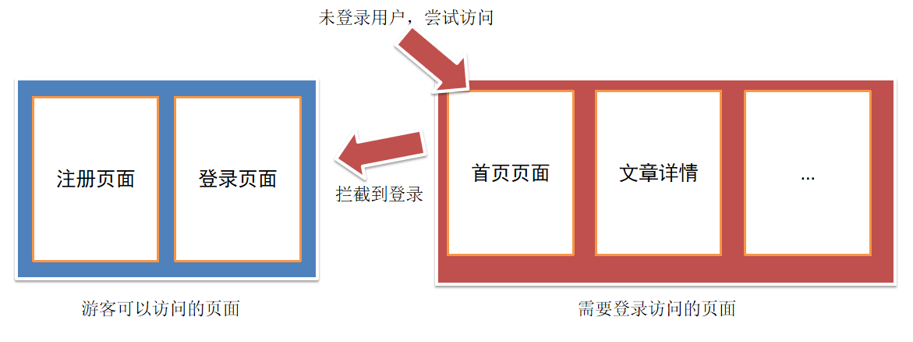
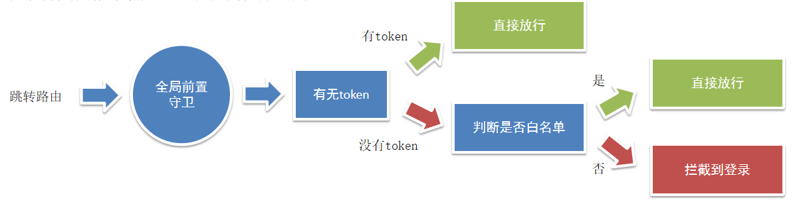
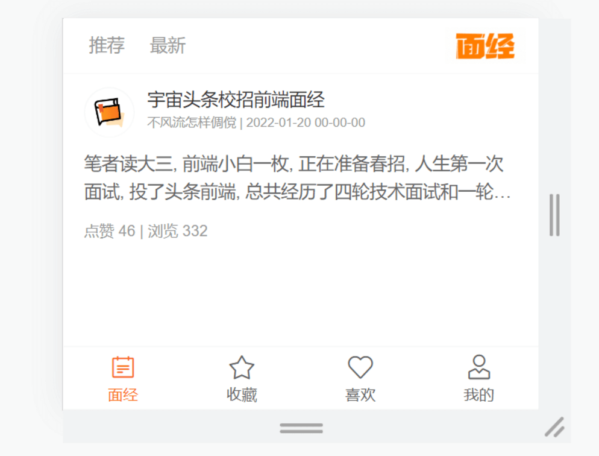
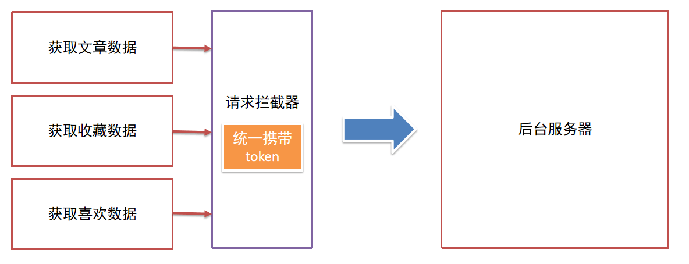
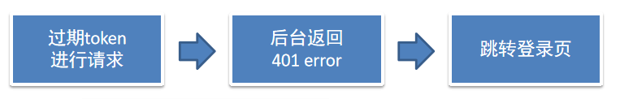
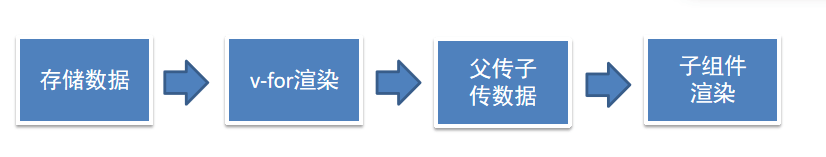
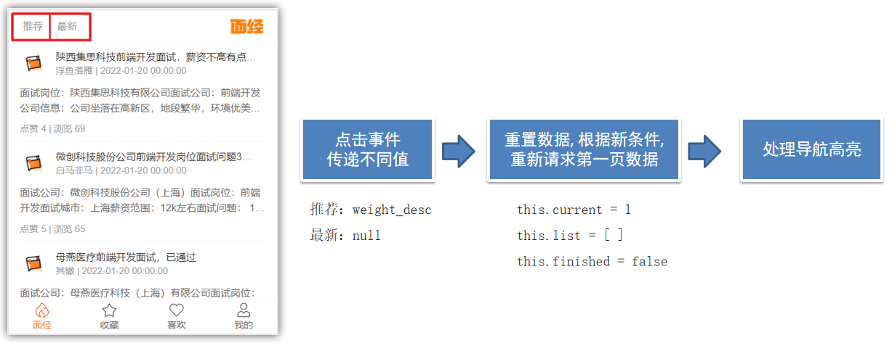

# day08-授课大纲

## 一、全局前置守卫-语法认识

这个 面经移动端 项目，只对 登录用户 开放，如果未登录，一律拦截到登录

1. 如果访问的是 **首页**，     无token， 拦走

2. 如果访问的是 **列表页**，无token， 拦走

3. 如果访问的是 **详情页**，无token， 拦走

   ....

分析：哪些页面，是不需要登录，就可以访问的！  =>  **注册**   和   **登录**  （白名单 - 游客可以随意访问的）



路由导航守卫 - **全局前置守卫**

- 访问的路径一旦被路由规则匹配到，都会先经过全局前置守卫


- 只有全局前置守卫放行，才会真正解析渲染组件，才能看到页面内容

router/index.js

```js
router.beforeEach((to, from, next) => {
  // 1. to   往哪里去， 到哪去的路由信息对象  
  // 2. from 从哪里来， 从哪来的路由信息对象
  // 3. next() 是否放行
  //    如果next()调用，就是放行
  //    next(路径) 拦截到某个路径页面
})
```


## 二、全局前置守卫-访问拦截处理

拦截或放行的关键点？ →  **用户是否有登录权证 token**

核心逻辑：

1. 判断用户有没有token， 有token， 直接放行  （有身份的人，想去哪就去哪~）
2. 没有token（游客），如果是白名单中的页面，直接放行
3. 否则，无token（游客），且在访问需要权限访问的页面，直接拦截到登录




```jsx
// 全局前置守卫：
// 1. 所有的路由一旦被匹配到，在真正渲染解析之前，都会先经过全局前置守卫
// 2. 只有全局前置守卫放行，才能看到真正的页面

// 任何路由，被解析访问前，都会先执行这个回调
// 1. from 你从哪里来， 从哪来的路由信息对象
// 2. to   你往哪里去， 到哪去的路由信息对象
// 3. next() 是否放行，如果next()调用，就是放行 => 放你去想去的页面
//    next(路径) 拦截到某个路径页面
import { getToken } from '@/utils/storage'

const whiteList = ['/login', '/register'] // 白名单列表，记录无需权限访问的所有页面

router.beforeEach((to, from, next) => {
  const token = getToken()
  // 如果有token，直接放行
  if (token) {
    next()
  } else {
    // 没有token的人, 看看你要去哪
    // (1) 访问的是无需授权的页面（白名单），也是放行
    //     就是判断，访问的地址，是否在白名单数组中存在 includes
    if (whiteList.includes(to.path)) {
      next()
    } else {
      // (2) 否则拦截到登录
      next('/login')
    }
  }
})
```


## 三、面经列表-认识Cell组件-准备基础布局

1.认识静态结构

2.注册组件：

- van-cell

```jsx
import Vue from 'vue'
import { Cell } from 'vant'
Vue.use(Cell)
```

3.静态结构 `Article.vue`

```jsx
<template>
  <div class="article-page">
    <nav class="my-nav van-hairline--bottom">
      <a
        href="javascript:;"
        >推荐</a
      >
      <a
        href="javascript:;"
        >最新</a
      >
      <div class="logo"></div>
    </nav>

    <van-cell class="article-item" >
      <template #title>
        <div class="head">
          
          <div class="con">
            <p class="title van-ellipsis">宇宙头条校招前端面经</p>
            <p class="other">不风流怎样倜傥 | 2022-01-20 00-00-00</p>
          </div>
        </div>
      </template>
      <template #label>
        <div class="body van-multi-ellipsis--l2">
          笔者读大三, 前端小白一枚, 正在准备春招, 人生第一次面试, 投了头条前端, 总共经历了四轮技术面试和一轮hr面, 不多说, 直接上题&nbsp;一面
        </div>
        <div class="foot">点赞 46 | 浏览 332</div>
      </template>
    </van-cell>
  </div>
</template>

<script>
export default {
  name: 'article-page',
  data () {
    return {

    }
  },
  methods: {

  }
}
</script>

<style lang="less" scoped>
.article-page {
  margin-bottom: 50px;
  margin-top: 44px;
  .my-nav {
    height: 44px;
    position: fixed;
    left: 0;
    top: 0;
    width: 100%;
    z-index: 999;
    background: #fff;
    display: flex;
    align-items: center;
    > a {
      color: #999;
      font-size: 14px;
      line-height: 44px;
      margin-left: 20px;
      position: relative;
      transition: all 0.3s;
      &::after {
        content: '';
        position: absolute;
        left: 50%;
        transform: translateX(-50%);
        bottom: 0;
        width: 0;
        height: 2px;
        background: #222;
        transition: all 0.3s;
      }
      &.active {
        color: #222;
        &::after {
          width: 14px;
        }
      }
    }
    .logo {
      flex: 1;
      display: flex;
      justify-content: flex-end;
      > img {
        width: 64px;
        height: 28px;
        display: block;
        margin-right: 10px;
      }
    }
  }
}
.article-item {
  .head {
    display: flex;
    img {
      width: 40px;
      height: 40px;
      border-radius: 50%;
      overflow: hidden;
    }
    .con {
      flex: 1;
      overflow: hidden;
      padding-left: 10px;
      p {
        margin: 0;
        line-height: 1.5;
        &.title {
          width: 280px;
        }
        &.other {
          font-size: 10px;
          color: #999;
        }
      }
    }
  }
  .body {
    font-size: 14px;
    color: #666;
    line-height: 1.6;
    margin-top: 10px;
  }
  .foot {
    font-size: 12px;
    color: #999;
    margin-top: 10px;
  }
}
</style>
```


## 四、封装 ArticleItem 组件

说明：每个文章列表项，其实就是一个整体，封装成一个组件  →   可阅读性 & 复用性

步骤：

- 新建  components/ArticleItem.vue  组件，贴入内容
- 注册成全局组件
- Article.vue 页面中应用

新建 `components/ArticleItem.vue` 组件

```jsx
<template>
  <van-cell class="article-item">
    <template #title>
      <div class="head">
        
        <div class="con">
          <p class="title van-ellipsis">宇宙头条校招前端面经</p>
          <p class="other">不风流怎样倜傥 | 2022-01-20 00-00-00</p>
        </div>
      </div>
    </template>
    <template #label>
      <div class="body van-multi-ellipsis--l2">
        笔者读大三, 前端小白一枚, 正在准备春招, 人生第一次面试, 投了头条前端,
        总共经历了四轮技术面试和一轮hr面, 不多说, 直接上题&nbsp;一面
      </div>
      <div class="foot">点赞 46 | 浏览 332</div>
    </template>
  </van-cell>
</template>

<script>
export default {
  name: 'ArticleItem'
}
</script>

<style lang="less" scoped>
.article-item {
  .head {
    display: flex;
    img {
      width: 40px;
      height: 40px;
      border-radius: 50%;
      overflow: hidden;
    }
    .con {
      flex: 1;
      overflow: hidden;
      padding-left: 10px;
      p {
        margin: 0;
        line-height: 1.5;
        &.title {
          width: 280px;
        }
        &.other {
          font-size: 10px;
          color: #999;
        }
      }
    }
  }
  .body {
    font-size: 14px;
    color: #666;
    line-height: 1.6;
    margin-top: 10px;
  }
  .foot {
    font-size: 12px;
    color: #999;
    margin-top: 10px;
  }
}
</style>

```

注册成全局组件使用

```jsx
import ArticleItem from '@/components/ArticleItem.vue'
Vue.component('ArticleItem', ArticleItem)
```

`Article.vue`页面中

```vue
<template>
  <div class="article-page">
    ... 
    <ArticleItem></ArticleItem>
  </div>
</template>
```


## 五、封装 api 接口-获取文章列表数据

接口：https://apifox.com/apidoc/project-934563/api-20384521

1.新建 `api/article.js` 提供接口函数

```jsx
import request from '@/utils/request'

export const getArticles = (obj) => {
  return request.get('/interview/query', {
    params: {
      current: obj.current,
      sorter: obj.sorter,
      pageSize: 10
    }
  })
}
```

2.页面中调用测试

```jsx
import { getArticles } from '@/api/article'
export default {
  name: 'article-page',
  data () {
    return {

    }
  },
  async created () {
    const res = await getArticles({
      current: 1,
      sorter: 'weight_desc'
    })
    console.log(res)
  },
  methods: {

  }
}
```

3.发现 401 错误,  通过 headers 携带 token

注意：这个token，需要拼上前缀 `Bearer ` token标识前缀

```jsx
// 封装接口，获取文章列表
export const getArticles = (obj) => {
  const token = getToken()

  return request.get('/interview/query', {
    params: {
      current: obj.current, // 当前页
      pageSize: 10, // 每页条数
      sorter: obj.sorter // 排序字段 =>  传"weight_desc" 获取 推荐， "不传" 获取 最新
    },
    headers: {
      // 注意 Bearer 和 后面的空格不能删除，为后台的token辨识
      Authorization: `Bearer ${token}`
    }
  })
}
```


## 六、请求拦截器-携带 token

`utils/request.js`



每次自己携带token太麻烦，通过请求拦截器统一携带token更方便

```jsx
import { getToken } from './storage'

// 添加请求拦截器
request.interceptors.request.use(function (config) {
  // 在发送请求之前做些什么
  const token = getToken()
  if (token) {
    config.headers.Authorization = `Bearer ${token}`
  }
  return config
}, function (error) {
  // 对请求错误做些什么
  return Promise.reject(error)
})
```


## 七、响应拦截器-处理token过期

说明：token 是有过期时间的 (6h)，一旦 过期 或 失效 就无法正确获取到数据！



`utils/request.js`

```jsx
// 添加响应拦截器
request.interceptors.response.use(function (response) {
  // 对响应数据做点什么
  return response.data
}, function (error) {
  if (error.response) {
    // 有错误响应, 提示错误提示
    if (error.response.status === 401) {
      delToken()
      router.push('/login')
    } else {
      Toast(error.response.data.message)
    }
  }
  // 对响应错误做点什么
  return Promise.reject(error)
})
```


## 八、面经列表-动态渲染列表



`article.vue`

存储数据

```jsx
import {getArticles} from '@/api/article'
data () {
  return {
    list: [],
    current: 1,
    sorter: 'weight_desc'
  }
},
async created () {
  const { data } = await getArticles({
    current: this.current,
    sorter: this.sorter
  })
  this.list = data.data.rows
},
```

v-for循环展示

```jsx
<template>
  <div class="article-page">
    ...

    <ArticleItem v-for="(item,i) in list" :key="item.id" :item="item"></ArticleItem>
  </div>
</template>
```

子组件接收渲染

```jsx
<template>
  <van-cell class="article-item" @click="$router.push(`/detail/${item.id}`)">
    <template #title>
      <div class="head">
        
        <div class="con">
          <p class="title van-ellipsis">{{ item.stem }}</p>
          <p class="other">{{ item.creator }} | {{ item.createdAt }}</p>
        </div>
      </div>
    </template>
    <template #label>
      <div class="body van-multi-ellipsis--l2" v-html="item.content"></div>
      <div class="foot">点赞 {{ item.likeCount }} | 浏览 {{ item.views }}</div>
    </template>
  </van-cell>
</template>

<script>
export default {
  name: 'ArticleItem',
  props: {
    item: {
      type: Object,
      default: () => ({})
    }
  }
}
</script>

<style lang="less" scoped>
.article-item {
  .head {
    display: flex;
    img {
      width: 40px;
      height: 40px;
      border-radius: 50%;
      overflow: hidden;
    }
    .con {
      flex: 1;
      overflow: hidden;
      padding-left: 10px;
      p {
        margin: 0;
        line-height: 1.5;
        &.title {
          width: 280px;
        }
        &.other {
          font-size: 10px;
          color: #999;
        }
      }
    }
  }
  .body {
    font-size: 14px;
    color: #666;
    line-height: 1.6;
    margin-top: 10px;
  }
  .foot {
    font-size: 12px;
    color: #999;
    margin-top: 10px;
  }
}
</style>
```


## 九、面经列表-响应拦截器-简化响应

```jsx
// 添加响应拦截器
instance.interceptors.response.use(function (response) {
  // 对响应数据做点什么
  return response.data
}, function (error) {
  // console.log(error)
  // 有错误响应，后台正常返回了错误信息
  if (error.response) {
    if (error.response.status === 401) {
      // 清除掉无效的token
      delToken()
      // 拦截到登录
      router.push('/login')
    } else {
      // 有错误响应，提示错误消息
      // this.$toast(error.response.data.message)
      Toast(error.response.data.message)
    }
  }
  // 对响应错误做点什么
  return Promise.reject(error)
})
```

Login.vue

```jsx
setToken(data.token)
```

Article.vue

```jsx
async created () {
  // 获取推荐的，第1页的10条数据
  const res = await getArticles({
    current: this.current,
    sorter: this.sorter
  })
  this.list = res.data.rows
},
```


## 十、面经列表-分页加载更多

https://vant-contrib.gitee.io/vant/v2/#/zh-CN/list

```jsx
<van-list
  v-model="loading"
  :finished="finished"
  finished-text="没有更多了"
  @load="onLoad"
>
  <ArticleItem v-for="(item,i) in list" :key="i" :item="item"></ArticleItem>
</van-list>

data () {
  return {
    list: [],
    current: 1,
    sorter: 'weight_desc',
    loading: false,
    finished: false
  }
},
    
methods: {
  async onLoad () {
    const { data } = await getArticles({
      current: this.current,
      sorter: this.sorter
    })
    this.list = data.rows
  }
}
```

加载完成，重置 loading,  累加数据，处理 finished

```jsx
async onLoad () {
  const { data } = await getArticles({
    current: this.current,
    sorter: this.sorter
  })
  this.list.push(...data.rows)
  this.loading = false
  this.current++

  if (this.current > data.pageTotal) {
    this.finished = true
  }
}
```


## 十一、面经列表-推荐和更新

1.切换推荐和最新 获取不同的数据

2.切换推荐和最新 点击的tab页签应该高亮



`article.vue`

```jsx
<a
  @click="changeSorter('weight_desc')"
  :class="{ active: sorter === 'weight_desc' }"
  href="javascript:;"
  >推荐</a
>
<a
  @click="changeSorter(null)"
  :class="{ active: sorter === null }"
  href="javascript:;"
  >最新</a
>
```

提供methods

```jsx
changeSorter (value) {
  this.sorter = value

  // 重置所有条件
  this.current = 1 // 排序条件变化，重新从第一页开始加载
  this.list = []
  this.finished = false // finished重置，重新有数据可以加载了
  // this.loading = false

  // 手动加载更多
  // 手动调用了加载更多，也需要手动将loading改成true，表示正在加载中（避免重复触发）
  this.loading = true
  this.onLoad()
}
```


## 十二、面经详情-动态路由传参-请求渲染

### 1.跳转路由传参

**核心知识点：跳转路由传参**

准备动态路由 (已准备)

```jsx
const router = new VueRouter({
  routes: [
	...,
    { path: '/article/:id', component: Detail },
    {
      path: '/',
      component: Layout,
      redirect: '/article',
      children: [
       	...
      ]
    }
  ]
})
```

点击跳转 `article.vue`

```jsx
<template>
  <!-- 文章区域 -->
  <van-cell class="article-item" @click="$router.push(`/detail/${item.id}`)">
    <template #title>
      ...
    </template>
    <template #label>
      ...
    </template>
  </van-cell>
</template>
```

页面中获取参数

```jsx
this.$route.params.id
```


### 2.动态渲染 (页面代码准备)

**准备代码：**

导入图标组件：

```jsx
Vue.use(Icon)
```

静态结构：

```jsx
<template>
  <div class="detail-page">
    <van-nav-bar
      left-text="返回"
      @click-left="$router.back()"
      fixed
      title="面经详情"
    />
    <header class="header">
      <h1>大标题</h1>
      <p>
        2050-04-06 | 300 浏览量 | 222 点赞数
      </p>
      <p>
        
        <span>作者</span>
      </p>
    </header>
    <main class="body">
      <p>我是内容</p>
      <p>我是内容</p>
      <p>我是内容</p>
      <p>我是内容</p>
    </main>
    <div class="opt">
      <van-icon class="active" name="like-o"/>
      <van-icon name="star-o"/>
    </div>
  </div>
</template>

<script>
export default {
  name: 'detail-page',
  data () {
    return {
      article: {}
    }
  },
  async created () {

  },
  methods: {

  }
}
</script>

<style lang="less" scoped>
.detail-page {
  margin-top: 44px;
  overflow: hidden;
  padding: 0 15px;
  .header {
    h1 {
      font-size: 24px;
    }
    p {
      color: #999;
      font-size: 12px;
      display: flex;
      align-items: center;
    }
    img {
      width: 40px;
      height: 40px;
      border-radius: 50%;
      overflow: hidden;
    }
  }
  .opt {
    position: fixed;
    bottom: 100px;
    right: 0;
    > .van-icon {
      margin-right: 20px;
      background: #fff;
      width: 40px;
      height: 40px;
      line-height: 40px;
      text-align: center;
      border-radius: 50%;
      box-shadow: 2px 2px 10px #ccc;
      font-size: 18px;
      &.active {
        background: #FEC635;
        color: #fff;
      }
    }
  }
}
</style>

```

### 3.代码实现

3.1封装api接口函数

`api/article.js`

```jsx
export const getArticleDetail = (id) => {
  return request.get('interview/show', {
    params: {
      id
    }
  })
}
```

3.2动态渲染

`Detail.vue`

```jsx
<template>
  <div class="detail-page">
    <van-nav-bar
      left-text="返回"
      @click-left="$router.back()"
      fixed
      title="面经详细"
    />
    <header class="header">
      <h1>{{ article.stem }}</h1>
      <p>
        {{ article.createdAt }} | {{ article.views }} 浏览量 |
        {{ article.likeCount }} 点赞数
      </p>
      <p>
        
        <span>{{ article.creator }}</span>
      </p>
    </header>
    <main class="body" v-html="article.content"></main>
    <div class="opt">
      <van-icon :class="{active:article.likeFlag}" name="like-o"/>
      <van-icon :class="{active:article.collectFlag}" name="star-o"/>
    </div>
  </div>
</template>

<script>
import { getArticleDetail } from '@/api/article'

export default {
  name: 'detail-page',
  data () {
    return {
      article: {}
    }
  },
  async created () {
    this.article = {}
    const { data } = await getArticleDetail(this.$route.params.id)
    this.article = data
  },
  methods: {

  }
}
</script>
```


## 十三、面经详情-点赞收藏  

封装准备接口

`api/article.js`

```jsx
export const updateLike = (id) => {
  return request.post('interview/opt', {
    id,
    optType: 1 // 喜欢
  })
}

export const updateCollect = (id) => {
  return request.post('interview/opt', {
    id,
    optType: 2 // 收藏
  })
}
```

`Detail.vue`

调用接口实现点赞收藏

```jsx
<template>
  <div class="detail-page">
    <van-nav-bar
      left-text="返回"
      @click-left="$router.back()"
      fixed
      title="面经详细"
    />
    <header class="header">
      <h1>{{ article.stem }}</h1>
      <p>
        {{ article.createdAt }} | {{ article.views }} 浏览量 |
        {{ article.likeCount }} 点赞数
      </p>
      <p>
        
        <span>{{ article.creator }}</span>
      </p>
    </header>
    <main class="body" v-html="article.content"></main>
    <div class="opt">
      <van-icon @click="toggleLike" :class="{active:article.likeFlag}" name="like-o"/>
      <van-icon @click="toggleCollect" :class="{active:article.collectFlag}" name="star-o"/>
    </div>
  </div>
</template>

<script>
import { getArticleDetail, updateCollect, updateLike } from '@/api/article';

export default {
  name: 'detail-page',
  data() {
    return {
      article: {}
    };
  },
  async created() {
    this.article = {}
    const { data } = await getArticleDetail(this.$route.params.id)
    this.article = data;
  },
  methods: {
    async toggleLike () {
      await updateLike(this.article.id)
      this.article.likeFlag = !this.article.likeFlag
      if ( this.article.likeFlag ) {
        this.article.likeCount ++
        this.$toast.success('点赞成功')
      } else {
        this.article.likeCount --
        this.$toast.success('取消点赞')
      }
    },
    async toggleCollect () {
      await updateCollect(this.article.id)
      this.article.collectFlag = !this.article.collectFlag
      if ( this.article.collectFlag ) {
        this.$toast.success('收藏成功')
      } else {
        this.$toast.success('取消收藏')
      }
    }
  }
};
</script>

<style lang="less" scoped>
.detail-page {
  margin-top: 44px;
  overflow: hidden;
  padding: 0 15px;
  .header {
    h1 {
      font-size: 24px;
    }
    p {
      color: #999;
      font-size: 12px;
      display: flex;
      align-items: center;
    }
    img {
      width: 40px;
      height: 40px;
      border-radius: 50%;
      overflow: hidden;
    }
  }
  .opt {
    position: fixed;
    bottom: 100px;
    right: 0;
    > .van-icon {
      margin-right: 20px;
      background: #fff;
      width: 40px;
      height: 40px;
      line-height: 40px;
      text-align: center;
      border-radius: 50%;
      box-shadow: 2px 2px 10px #ccc;
      font-size: 18px;
      &.active {
        background: #FEC635;
        color: #fff;
      }
    }
  }
}
</style>
```


## 十四、我的收藏 (实战)

提供api方法

- page： 表示当前页
- optType：2 表示获取我的收藏数据

`api/article.js`

```jsx
// 获取我的收藏
export const getArticlesCollect = (obj) => {
  return request.get('/interview/opt/list', {
    params: {
      page: obj.page, // 当前页
      pageSize: 5, // 可选
      optType: 2 // 表示收藏
    }
  })
}
```

`collect.vue`准备结构

```jsx
<template>
  <div class="collect-page">
    <van-nav-bar fixed title="我的收藏" />
    <van-list
      v-model="loading"
      :finished="finished"
      finished-text="没有更多了"
      @load="onLoad"
    >
      <ArticleItem v-for="(item, i) in list" :key="i" :item="item" />
    </van-list>
  </div>
</template>

<script>
import { getArticlesCollect } from '@/api/article'
export default {
  name: 'collect-page',
  data () {
    return {
      list: [],
      loading: false,
      finished: false,
      page: 1
    }
  },
  methods: {
    async onLoad () {
      // 异步更新数据
      const { data } = await getArticlesCollect({ page: this.page })
      this.list.push(...data.rows)
      this.loading = false
      this.page++

      if (this.page > data.pageTotal) {
        this.finished = true
      }
    }
  }
}
</script>

<style lang="less" scoped>
.collect-page {
  margin-bottom: 50px;
  margin-top: 44px;
}
</style>
```


## 十五、我的喜欢 (快速实现)

准备api函数

- page： 表示当前页
- optType：1 表示获取我的喜欢数据

`api/article.js`

```jsx
// 获取我的喜欢
export const getArticlesLike = (obj) => {
  return request.get('/interview/opt/list', {
    params: {
      page: obj.page, // 当前页
      pageSize: 5, // 可选
      optType: 1 // 表示喜欢
    }
  })
}
```

`Like.vue`请求渲染

```jsx
<template>
  <div class="like-page">
    <van-nav-bar fixed title="我的点赞" />
    <van-list
      v-model="loading"
      :finished="finished"
      finished-text="没有更多了"
      @load="onLoad"
    >
      <ArticleItem v-for="(item,i) in list" :key="i" :item="item" />
    </van-list>
  </div>
</template>

<script>
import { getArticlesLike } from '@/api/article'
export default {
  name: 'like-page',
  data () {
    return {
      list: [],
      loading: false,
      finished: false,
      page: 1
    }
  },
  methods: {
    async onLoad () {
      // 异步更新数据
      const { data } = await getArticlesLike({ page: this.page })
      this.list.push(...data.rows)
      this.loading = false
      this.page++

      if (this.page > data.pageTotal) {
        this.finished = true
      }
    }
  }
}
</script>

<style lang="less" scoped>
.like-page {
  margin-bottom: 50px;
  margin-top: 44px;
}
</style>
```


## 十六、个人中心 (快速实现)

**准备代码：**

1 注册组件

```jsx
import {
  Grid,
  GridItem,
  CellGroup
} from 'vant'

Vue.use(Grid)
Vue.use(GridItem)
Vue.use(CellGroup)
```

2 准备api

`api/user.js`

```jsx
// 获取用户信息
export const getUserInfo = () => {
  return request('/user/currentUser')
}
```

3 页面调用渲染

```jsx
<template>
  <div class="user-page">
    <div class="user">
      
      <h3>{{ username }}</h3>
    </div>
    <van-grid clickable :column-num="3" :border="false">
      <van-grid-item icon="clock-o" text="历史记录" to="/" />
      <van-grid-item icon="bookmark-o" text="我的收藏" to="/collect" />
      <van-grid-item icon="thumb-circle-o" text="我的点赞" to="/like" />
    </van-grid>

    <van-cell-group class="mt20">
      <van-cell title="推荐分享" is-link />
      <van-cell title="意见反馈" is-link />
      <van-cell title="关于我们" is-link />
      <van-cell @click="logout" title="退出登录" is-link />
    </van-cell-group>
  </div>
</template>

<script>
import { getUserInfo } from '@/api/user'
import { delToken } from '@/utils/storage'
export default {
  name: 'user-page',
  data () {
    return {
      username: '',
      avatar: ''
    }
  },
  async created () {
    const { data } = await getUserInfo()
    this.username = data.username
    this.avatar = data.avatar
  },
  methods: {
    logout () {
      delToken()
      this.$router.push('/login')
    }
  }
}
</script>

<style lang="less" scoped>
.user-page {
  padding: 0 10px;
  background: #f5f5f5;
  height: 100vh;
  .mt20 {
    margin-top: 20px;
  }
  .user {
    display: flex;
    padding: 20px 0;
    align-items: center;
    img {
      width: 80px;
      height: 80px;
      border-radius: 50%;
      overflow: hidden;
    }
    h3 {
      margin: 0;
      padding-left: 20px;
      font-size: 18px;
    }
  }
}
</style>
```


## 十七、打包发布

vue脚手架只是开发过程中，协助开发的工具，当真正开发完了 => 脚手架不参与上线

参与上线的是 => 打包后的源代码

打包：

- 将多个文件压缩合并成一个文件
- 语法降级
- less sass ts 语法解析, 解析成css
- ....

打包后，可以生成，浏览器能够直接运行的网页 => 就是需要上线的源码！

### 打包命令

vue脚手架工具已经提供了打包命令，直接使用即可。

```bash
yarn build
```

在项目的根目录会自动创建一个文件夹`dist`,dist中的文件就是打包后的文件，只需要放到服务器中即可。

### 配置publicPath

```js
module.exports = {
  // 设置获取.js,.css文件时，是以相对地址为基准的。
  // https://cli.vuejs.org/zh/config/#publicpath
  publicPath: './'
}
```


## 十八、路由懒加载

路由懒加载 & 异步组件， 不会一上来就将所有的组件都加载，而是访问到对应的路由了，才加载解析这个路由对应的所有组件

官网链接：https://router.vuejs.org/zh/guide/advanced/lazy-loading.html#%E4%BD%BF%E7%94%A8-webpack

> 当打包构建应用时，JavaScript 包会变得非常大，影响页面加载。如果我们能把不同路由对应的组件分割成不同的代码块，然后当路由被访问的时候才加载对应组件，这样就更加高效了。

```js
const Detail = () => import('@/views/detail')
const Register = () => import('@/views/register')
const Login = () => import('@/views/login')
const Article = () => import('@/views/article')
const Collect = () => import('@/views/collect')
const Like = () => import('@/views/like')
const User = () => import('@/views/user')
```


PS： 如果想要手机上看到效果，可以将打包后的代码，上传到 gitee，利用 git pages 进行展示
