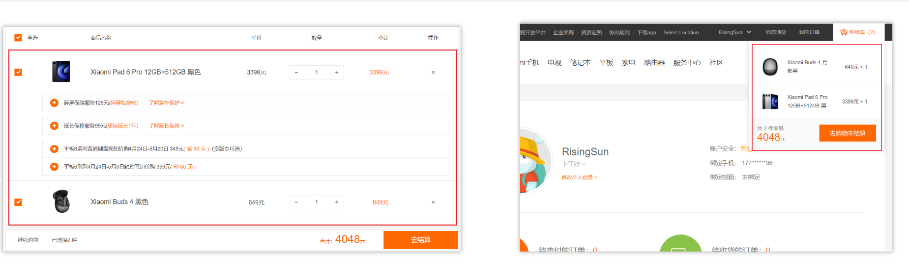
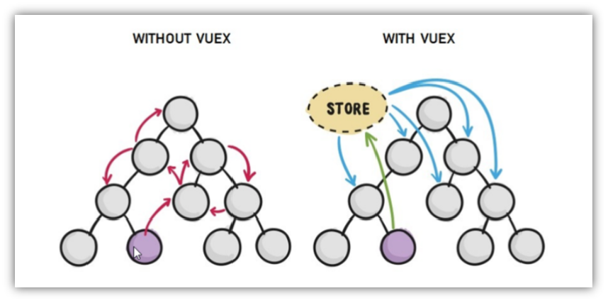
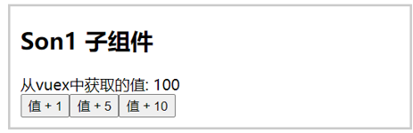
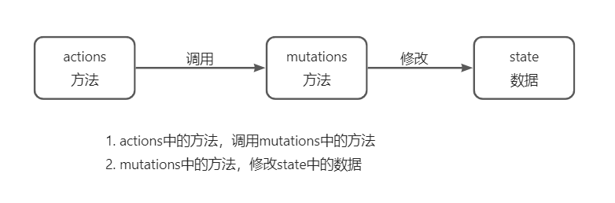
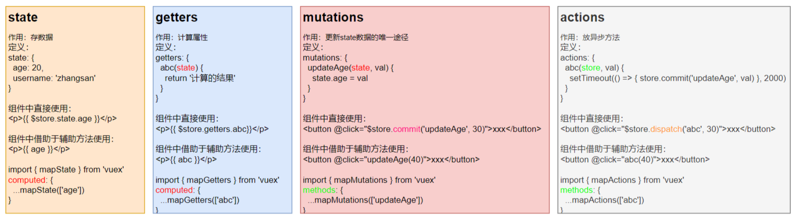
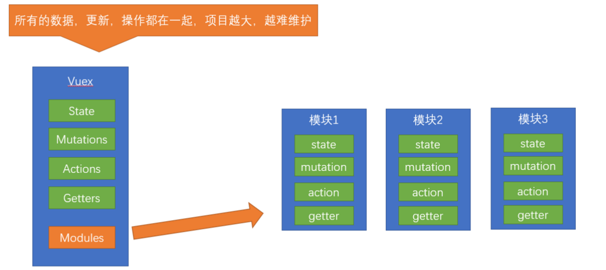
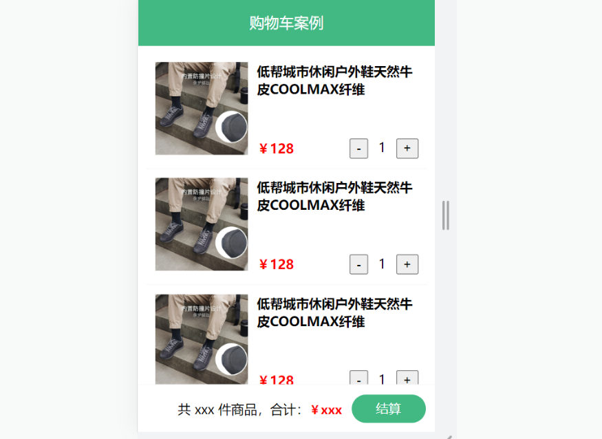

## 一、[Vuex](https://vuex.vuejs.org/zh/) 概述 

目标：明确[Vuex](https://vuex.vuejs.org/zh/)是什么，应用场景以及优势

### 1.是什么

Vuex 是一个 Vue 的 状态管理工具，状态就是数据。

大白话：Vuex 是一个插件，可以帮我们管理 Vue 通用的数据 (多组件共享的数据)。例如：购物车数据   个人信息数


### 2.使用场景

- 某个状态 在 很多个组件 来使用 (个人信息)


- 多个组件 共同维护 一份数据 (购物车)



### 3.优势

- 共同维护一份数据，**数据集中化管理**
-  **响应式变化**
- 操作简洁 (vuex提供了一些辅助函数)



### 4.注意：

官方原文：

- 不是所有的场景都适用于vuex，只有在必要的时候才使用vuex
- 使用了vuex之后，会附加更多的框架中的概念进来，增加了项目的复杂度  （数据的操作更便捷，数据的流动更清晰）

Vuex就像《近视眼镜》, 你自然会知道什么时候需要用它~

 

## 二、需求: 多组件共享数据

目标：基于脚手架创建项目，构建 vuex 多组件数据共享环境


效果是三个组件共享一份数据:

- 任意一个组件都可以修改数据
- 三个组件的数据是同步的

### 1.创建项目

```
vue create vuex-demo
```

### 2.创建三个组件, 目录如下

```
|-components
|--Son1.vue
|--Son2.vue
|-App.vue
```

### 3.源代码如下

`App.vue`在入口组件中引入 Son1 和 Son2 这两个子组件

```html
<template>
  <div id="app">
    <h1>根组件</h1>
    <input type="text">
    <Son1></Son1>
    <hr>
    <Son2></Son2>
  </div>
</template>

<script>
import Son1 from './components/Son1.vue'
import Son2 from './components/Son2.vue'

export default {
  name: 'app',
  data: function () {
    return {

    }
  },
  components: {
    Son1,
    Son2
  }
}
</script>

<style>
#app {
  width: 600px;
  margin: 20px auto;
  border: 3px solid #ccc;
  border-radius: 3px;
  padding: 10px;
}
</style>

```

`main.js`

```js
import Vue from 'vue'
import App from './App.vue'

Vue.config.productionTip = false

new Vue({
  render: h => h(App)
}).$mount('#app')
```

`Son1.vue`

```html
<template>
  <div class="box">
    <h2>Son1 子组件</h2>
    从vuex中获取的值: <label></label>
    <br>
    <button>值 + 1</button>
  </div>
</template>

<script>
export default {
  name: 'Son1Com'
}
</script>

<style lang="css" scoped>
.box{
  border: 3px solid #ccc;
  width: 400px;
  padding: 10px;
  margin: 20px;
}
h2 {
  margin-top: 10px;
}
</style>

```

`Son2.vue`

```html
<template>
  <div class="box">
    <h2>Son2 子组件</h2>
    从vuex中获取的值:<label></label>
    <br />
    <button>值 - 1</button>
  </div>
</template>

<script>
export default {
  name: 'Son2Com'
}
</script>

<style lang="css" scoped>
.box {
  border: 3px solid #ccc;
  width: 400px;
  padding: 10px;
  margin: 20px;
}
h2 {
  margin-top: 10px;
}
</style>
```


## 三、vuex 的使用 - 创建仓库


### 1.安装 vuex

安装vuex与vue-router类似，vuex是一个独立存在的插件，如果脚手架初始化没有选 vuex，就需要额外安装。

```bash
yarn add vuex@3 或者 npm i vuex@3
```

### 2.新建 `store/index.js` 专门存放 vuex

​	为了维护项目目录的整洁，在src目录下新建一个store目录其下放置一个index.js文件。 (和 `router/index.js` 类似)

​	

### 3.创建仓库 `store/index.js` 

```jsx
// 导入 vue
import Vue from 'vue'
// 导入 vuex
import Vuex from 'vuex'
// vuex也是vue的插件, 需要use一下, 进行插件的安装初始化
Vue.use(Vuex)

// 创建仓库 store
const store = new Vuex.Store()

// 导出仓库
export default store
```

### 4 在 main.js 中导入挂载到 Vue 实例上

```js
import Vue from 'vue'
import App from './App.vue'
import store from './store'

Vue.config.productionTip = false

new Vue({
  render: h => h(App),
  store
}).$mount('#app')
```

此刻起, 就成功创建了一个 **空仓库!!**

### 5.测试打印Vuex

App.vue

```js
created(){
  console.log(this.$store)
}
```


## 四、核心概念 - state 状态

### 1.目标

明确如何给仓库 提供 数据，如何 使用 仓库的数据

### 2.提供数据

State提供唯一的公共数据源，所有共享的数据都要统一放到Store中的State中存储。

打开项目中的store.js文件，在state对象中可以添加我们要共享的数据。

```jsx
// 创建仓库 store
const store = new Vuex.Store({
  // state 状态, 即数据, 类似于vue组件中的data,
  // 区别：
  // 1.data 是组件自己的数据, 
  // 2.state 中的数据整个vue项目的组件都能访问到
  state: {
    count: 101
  }
})
```

### 3.访问Vuex中的数据

问题: 如何在组件中获取count?

1. 通过$store直接访问  —>  {{  $store.state.count  }}
2. 通过辅助函数mapState 映射计算属性  —>  {{ count  }}


### 4.通过$store访问的语法

```js
获取 store：
 1.Vue模板中获取 this.$store
 2.js文件中获取 import 导入 store


模板中：     {{ $store.state.xxx }}
组件逻辑中：  this.$store.state.xxx
JS模块中：   store.state.xxx
```


### 5.代码实现

#### 5.1模板中使用

组件中可以使用  **$store** 获取到vuex中的store对象实例，可通过**state**属性属性获取**count**， 如下

```vue
<h1>state的数据 - {{ $store.state.count }}</h1>
```

#### 5.2组件逻辑中使用

将state属性定义在计算属性中 https://vuex.vuejs.org/zh/guide/state.html

```js
<h1>state的数据 - {{ count }}</h1>

// 把state中数据，定义在组件内的计算属性中
  computed: {
    count () {
      return this.$store.state.count
    }
  }
```

#### 5.3 js文件中使用

```vue
//main.js

import store from "@/store"

console.log(store.state.count)
```

每次都像这样一个个的提供计算属性, 太麻烦了,我们有没有简单的语法帮我们获取state中的值呢？


## 五、通过辅助函数  - mapState获取 state中的数据

>mapState是辅助函数，帮助我们把store中的数据映射到 组件的计算属性中, 它属于一种方便的用法

用法 ：

 

### 1.第一步：导入mapState (mapState是vuex中的一个函数)

```js
import { mapState } from 'vuex'
```

### 2.第二步：采用数组形式引入state属性

```js
mapState(['count']) 
```

> 上面代码的最终得到的是 **类似于**

```js
count () {
    return this.$store.state.count
}
```

### 3.第三步：利用**展开运算符**将导出的状态映射给计算属性

```js
  computed: {
    ...mapState(['count'])
  }
```

```vue
 <div> state的数据：{{ count }}</div>
```


## 六、开启严格模式及Vuex的单项数据流

### 1.目标

明确 vuex 同样遵循单向数据流，组件中不能直接修改仓库的数据

### 2.直接在组件中修改Vuex中state的值


Son1.vue

```vue
button @click="handleAdd">值 + 1</button>


methods:{
	 handleAdd (n) {
      // 错误代码(vue默认不会监测，监测需要成本)
       this.$store.state.count++
      // console.log(this.$store.state.count) 
    },
}
```

### 3.开启严格模式

通过 `strict: true` 可以开启严格模式,开启严格模式后，直接修改state中的值会报错

> **state数据的修改只能通过mutations，并且mutations必须是同步的**


## 七、核心概念-mutations

### 1.定义mutations

```js
const store  = new Vuex.Store({
  state: {
    count: 0
  },
  // 定义mutations
  mutations: {
     
  }
})
```

### 2.格式说明

mutations是一个对象，对象中存放修改state的方法

```js
mutations: {
    // 方法里参数 第一个参数是当前store的state属性
    // payload 载荷 运输参数 调用mutaiions的时候 可以传递参数 传递载荷
    addCount (state) {
      state.count += 1
    }
  },
```

### 3.组件中提交 mutations

```jsx
this.$store.commit('addCount')
```

### 4.练习

1.在mutations中定义个点击按钮进行 +5 的方法

2.在mutations中定义个点击按钮进行 改变title 的方法

3.在组件中调用mutations修改state中的值

### 5.总结

通过mutations修改state的步骤

1.定义 mutations 对象，对象中存放修改 state 的方法

2.组件中提交调用 mutations(通过$store.commit('mutations的方法名'))


## 八、带参数的 mutations

### 1.目标：

掌握 mutations 传参语法

### 2.语法

看下面这个案例，每次点击不同的按钮，加的值都不同，每次都要定义不同的mutations处理吗？



提交 mutation 是可以传递参数的  `this.$store.commit('xxx',  参数)`

#### 2.1 提供mutation函数（带参数）

```js
mutations: {
  ...
  addCount (state, count) {
    state.count = count
  }
},
```

#### 2.2 提交mutation

```jsx
handle ( ) {
  this.$store.commit('addCount', 10)
}
```

**小tips: 提交的参数只能是一个, 如果有多个参数要传, 可以传递一个对象**

```jsx
this.$store.commit('addCount', {
  count: 10
})
```


## 九、练习-mutations的减法功能


### 1.步骤


### 2.代码实现

Son2.vue

```vue
    <button @click="subCount(1)">值 - 1</button>
    <button @click="subCount(5)">值 - 5</button>
    <button @click="subCount(10)">值 - 10</button>

    export default {
        methods:{
             subCount (n) { 
                this.$store.commit('addCount', n)
        },
        }
    }
```

store/index.js

```js
mutations:{
    subCount (state, n) {
      state.count -= n
    },
}
```


## 十、练习-Vuex中的值和组件中的input双向绑定

### 1.目标

实时输入，实时更新，巩固 mutations 传参语法


### 2.实现步骤


### 3.代码实现

App.vue

```vue
<input :value="count" @input="handleInput" type="text">

export default {
  methods: {
    handleInput (e) {
      // 1. 实时获取输入框的值
      const num = +e.target.value
      // 2. 提交mutation，调用mutation函数
      this.$store.commit('changeCount', num)
    }
  }
}
```

store/index.js

```js
mutations: { 
   changeCount (state, newCount) {
      state.count = newCount
   }
},
```


## 十一、辅助函数- mapMutations

> mapMutations和mapState很像，它把位于mutations中的方法提取了出来，我们可以将它导入

```js
import  { mapMutations } from 'vuex'
methods: {
    ...mapMutations(['addCount'])
}
```

> 上面代码的含义是将mutations的方法导入了methods中，等价于

```js
methods: {
      // commit(方法名, 载荷参数)
      addCount () {
          this.$store.commit('addCount')
      }
 }
```

此时，就可以直接通过this.addCount调用了

```jsx
<button @click="addCount">值+1</button>
```

但是请注意： Vuex中mutations中要求不能写异步代码，如果有异步的ajax请求，应该放置在actions中


## 十二、核心概念 - actions

> state是存放数据的，mutations是同步更新数据 (便于监测数据的变化, 更新视图等, 方便于调试工具查看变化)，
>
> actions则负责进行异步操作

**说明：mutations必须是同步的**

**需求: 一秒钟之后, 要给一个数 去修改state**


### **1.定义actions**

```js
mutations: {
  changeCount (state, newCount) {
    state.count = newCount
  }
}


actions: {
  setAsyncCount (context, num) {
    // 一秒后, 给一个数, 去修改 num
    setTimeout(() => {
      context.commit('changeCount', num)
    }, 1000)
  }
},
```

### **2.组件中通过dispatch调用** 

```js
setAsyncCount () {
  this.$store.dispatch('setAsyncCount', 666)
}
```



## 十三、辅助函数 -mapActions

1.目标：掌握辅助函数 mapActions，映射方法

> mapActions 是把位于 actions中的方法提取了出来，映射到组件methods中

Son2.vue

```js
import { mapActions } from 'vuex'
methods: {
   ...mapActions(['changeCountAction'])
}

//mapActions映射的代码 本质上是以下代码的写法
//methods: {
//  changeCountAction (n) {
//    this.$store.dispatch('changeCountAction', n)
//  },
//}
```

直接通过 this.方法 就可以调用

```vue
<button @click="changeCountAction(200)">+异步</button>
```


## 十四、核心概念 - getters

> 除了state之外，有时我们还需要从state中**筛选出符合条件的一些数据**，这些数据是依赖state的，此时会用到getters

例如，state中定义了list，为1-10的数组，

```js
state: {
    list: [1, 2, 3, 4, 5, 6, 7, 8, 9, 10]
}
```

组件中，需要显示所有大于5的数据，正常的方式，是需要list在组件中进行再一步的处理，但是getters可以帮助我们实现它

### 1.定义getters

```js
  getters: {
    // getters函数的第一个参数是 state
    // 必须要有返回值
     filterList:  state =>  state.list.filter(item => item > 5)
  }
```

### 2.使用getters

#### 2.1原始方式-$store

```vue
<div>{{ $store.getters.filterList }}</div>
```

#### 2.2辅助函数 - mapGetters

```js
computed: {
    ...mapGetters(['filterList'])
}
```

```vue
 <div>{{ filterList }}</div>
```

## 十五、使用小结



## 十六、核心概念 - module

### 1.目标

掌握核心概念 module 模块的创建

### 2.问题

由于使用**单一状态树**，应用的所有状态**会集中到一个比较大的对象**。当应用变得非常复杂时，store 对象就有可能变得相当臃肿。

这句话的意思是，如果把所有的状态都放在state中，当项目变得越来越大的时候，Vuex会变得越来越难以维护

由此，又有了Vuex的模块化




### **3.模块定义** - 准备 state

定义两个模块   **user** 和  **setting**

user中管理用户的信息状态  userInfo  `modules/user.js`

```jsx
const state = {
  userInfo: {
    name: 'zs',
    age: 18
  }
}

const mutations = {}

const actions = {}

const getters = {}

export default {
  state,
  mutations,
  actions,
  getters
}

```

setting中管理项目应用的  主题色 theme，描述 desc， `modules/setting.js`

```jsx
const state = {
  theme: 'dark'
  desc: '描述真呀真不错'
}

const mutations = {}

const actions = {}

const getters = {}

export default {
  state,
  mutations,
  actions,
  getters
}
```

在`store/index.js`文件中的modules配置项中，注册这两个模块

```js
import user from './modules/user'
import setting from './modules/setting'

const store = new Vuex.Store({
    modules:{
        user,
        setting
    }
})
```

使用模块中的数据,  可以直接通过模块名访问 `$store.state.模块名.xxx`  =>  `$store.state.setting.desc`

也可以通过 mapState 映射


## 十七、获取模块内的state数据

### 1.目标：

掌握模块中 state 的访问语法

尽管已经分模块了，但其实子模块的状态，还是会挂到根级别的 state 中，属性名就是模块名


### 2.使用模块中的数据

1.  直接通过模块名访问 $store.state.模块名.xxx
2.  通过 mapState 映射：
   1.  默认根级别的映射  mapState([ 'xxx' ])     
   2. 子模块的映射 ：mapState('模块名', ['xxx'])  -  需要开启命名空间 **namespaced:true**

`modules/user.js`

```jsx
const state = {
  userInfo: {
    name: 'zs',
    age: 18
  },
  myMsg: '我的数据'
}

const mutations = {
  updateMsg (state, msg) {
    state.myMsg = msg
  }
}

const actions = {}

const getters = {}

export default {
  namespaced: true,
  state,
  mutations,
  actions,
  getters
}
```

### 3.代码示例

$store直接访问

```js
$store.state.user.userInfo.name
```

mapState辅助函数访问

```js
...mapState('user', ['userInfo']),
...mapState('setting', ['theme', 'desc']),
```


## 十八、获取模块内的getters数据

### 1.目标：

掌握模块中 getters 的访问语

### 2.语法：

使用模块中 getters 中的数据： 

1. 直接通过模块名访问` $store.getters['模块名/xxx ']`
2. 通过 mapGetters 映射      
   1. 默认根级别的映射  `mapGetters([ 'xxx' ]) `
   2. 子模块的映射  `mapGetters('模块名', ['xxx'])` -  需要开启命名空间

### 3.代码演示

`modules/user.js`

```js
const getters = {
  // 分模块后，state指代子模块的state
  UpperCaseName (state) {
    return state.userInfo.name.toUpperCase()
  }
}
```

Son1.vue 直接访问getters

```html
<!-- 测试访问模块中的getters - 原生 -->
<div>{{ $store.getters['user/UpperCaseName'] }}</div>
```

Son2.vue 通过命名空间访问

```js
computed:{
  ...mapGetters('user', ['UpperCaseName'])
}
```


## 十九、获取模块内的mutations方法

### 1.目标：

掌握模块中 mutation 的调用语法

### 2.注意：

默认模块中的 mutation 和 actions 会被挂载到全局，**需要开启命名空间**，才会挂载到子模块。

### 3.调用方式：

1. 直接通过 store 调用   $store.commit('模块名/xxx ',  额外参数)
2. 通过 mapMutations 映射    
   1. 默认根级别的映射  mapMutations([ 'xxx' ])     
   2. 子模块的映射 mapMutations('模块名', ['xxx'])  -  需要开启命名空间

### 4.代码实现

`modules/user.js`

```js
const mutations = {
  setUser (state, newUserInfo) {
    state.userInfo = newUserInfo
  }
}
```

`modules/setting.js`

```js
const mutations = {
  setTheme (state, newTheme) {
    state.theme = newTheme
  }
}
```

Son1.vue

```vue
<button @click="updateUser">更新个人信息</button> 
<button @click="updateTheme">更新主题色</button>


export default {
  methods: {
    updateUser () {
      // $store.commit('模块名/mutation名', 额外传参)
      this.$store.commit('user/setUser', {
        name: 'xiaowang',
        age: 25
      })
    }, 
    updateTheme () {
      this.$store.commit('setting/setTheme', 'pink')
    }
  }
}
```


Son2.vue

```vue
<button @click="setUser({ name: 'xiaoli', age: 80 })">更新个人信息</button>
<button @click="setTheme('skyblue')">更新主题</button>

methods:{
// 分模块的映射
...mapMutations('setting', ['setTheme']),
...mapMutations('user', ['setUser']),
}
```


## 二十、获取模块内的actions方法

### 1.目标：

掌握模块中 action 的调用语法 (同理 - 直接类比 mutation 即可)

### 2.注意：

默认模块中的 mutation 和 actions 会被挂载到全局，**需要开启命名空间**，才会挂载到子模块。

### 3.调用语法：

1. 直接通过 store 调用   $store.dispatch('模块名/xxx ',  额外参数)
2. 通过 mapActions 映射     
   1.  默认根级别的映射  mapActions([ 'xxx' ])     
   2. 子模块的映射 mapActions('模块名', ['xxx'])  -  需要开启命名空间

### 4.代码实现

需求：


`modules/user.js`

```js
const actions = {
  setUserSecond (context, newUserInfo) {
    // 将异步在action中进行封装
    setTimeout(() => {
      // 调用mutation   context上下文，默认提交的就是自己模块的action和mutation
      context.commit('setUser', newUserInfo)
    }, 1000)
  }
}
```

Son1.vue  直接通过store调用

```vue
<button @click="updateUser2">一秒后更新信息</button>

methods:{
    updateUser2 () {
      // 调用action dispatch
      this.$store.dispatch('user/setUserSecond', {
        name: 'xiaohong',
        age: 28
      })
    },
}
```


Son2.vue mapActions映射

```js
<button @click="setUserSecond({ name: 'xiaoli', age: 80 })">一秒后更新信息</button>

methods:{
  ...mapActions('user', ['setUserSecond'])
}
```

## 二十一、Vuex模块化的使用小结

### 1.直接使用

1. state --> $store.state.**模块名**.数据项名
2. getters --> $store.getters['**模块名**/属性名']
3. mutations --> $store.commit('**模块名**/方法名', 其他参数)
4. actions --> $store.dispatch('**模块名**/方法名', 其他参数)

### 2.借助辅助方法使用

1.import { mapXxxx, mapXxx } from 'vuex'

computed、methods: {

​     // **...mapState、...mapGetters放computed中；**

​    //  **...mapMutations、...mapActions放methods中；**

​    ...mapXxxx(**'模块名'**, ['数据项|方法']),

​    ...mapXxxx(**'模块名'**, { 新的名字: 原来的名字 }),

}

2.组件中直接使用 属性 `{{ age }}` 或 方法 `@click="updateAge(2)"`


## 二十二、综合案例 - 创建项目

1. 脚手架新建项目 (注意：**勾选vuex**)      

   版本说明：

   vue2   vue-router3   vuex3               

   vue3  vue-router4  vuex4/pinia

```
vue create vue-cart-demo
```

2. 将原本src内容清空，替换成教学资料的《vuex-cart-准备代码》



需求：

1. 发请求动态渲染购物车，数据存vuex （存cart模块， 将来还会有user模块，article模块...）
2. 数字框可以修改数据
3. 动态计算总价和总数量


## 二十三、综合案例-构建vuex-cart模块

1. 新建 `store/modules/cart.js`

```jsx
export default {
  namespaced: true,
  state () {
    return {
      list: []
    }
  },
}
```

2. 挂载到 vuex 仓库上 `store/cart.js`

```jsx
import Vuex from 'vuex'
import Vue from 'vue'

import cart from './modules/cart'

Vue.use(Vuex)

const store = new Vuex.Store({
  modules: {
    cart
  }
})

export default store
```


## 二十四、综合案例-准备后端接口服务环境(了解)

1. 安装全局工具 json-server （全局工具仅需要安装一次）

```
yarn global add json-server 或 npm i json-server  -g
```

2. 代码根目录新建一个 db 目录
3. 将资料 index.json 移入 db 目录
4. 进入 db 目录，执行命令，启动后端接口服务 (使用--watch 参数 可以实时监听 json 文件的修改)

```
json-server  --watch  index.json
```


## 二十五、综合案例-请求动态渲染数据

### 1.目标

请求获取数据存入 vuex, 映射渲染


1. 安装 axios

```jsx
yarn add axios
```

2. 准备actions 和 mutations

```jsx
import axios from 'axios'

export default {
  namespaced: true,
  state () {
    return {
      list: []
    }
  },
  mutations: {
    updateList (state, payload) {
      state.list = payload
    }
  },
  actions: {
    async getList (ctx) {
      const res = await axios.get('http://localhost:3000/cart')
      ctx.commit('updateList', res.data)
    }
  }
}
```

3. `App.vue`页面中调用 action,  获取数据

```jsx
import { mapState } from 'vuex'

export default {
  name: 'App',
  components: {
    CartHeader,
    CartFooter,
    CartItem
  },
  created () {
    this.$store.dispatch('cart/getList')
  },
  computed: {
    ...mapState('cart', ['list'])
  }
}
```

4. 动态渲染

```jsx
<!-- 商品 Item 项组件 -->
<cart-item v-for="item in list" :key="item.id" :item="item"></cart-item>
```

`cart-item.vue`

```jsx
<template>
  <div class="goods-container">
    <!-- 左侧图片区域 -->
    <div class="left">
      
    </div>
    <!-- 右侧商品区域 -->
    <div class="right">
      <!-- 标题 -->
      <div class="title">{{item.name}}</div>
      <div class="info">
        <!-- 单价 -->
        <span class="price">￥{{item.price}}</span>
        <div class="btns">
          <!-- 按钮区域 -->
          <button class="btn btn-light">-</button>
          <span class="count">{{item.count}}</span>
          <button class="btn btn-light">+</button>
        </div>
      </div>
    </div>
  </div>
</template>

<script>
export default {
  name: 'CartItem',
  props: {
    item: Object
  },
  methods: {

  }
}
</script>
```


## 二十六、综合案例-修改数量


1. 注册点击事件

```jsx
<!-- 按钮区域 -->
<button class="btn btn-light" @click="onBtnClick(-1)">-</button>
<span class="count">{{item.count}}</span>
<button class="btn btn-light" @click="onBtnClick(1)">+</button>
```

2. 页面中dispatch action

```jsx
onBtnClick (step) {
  const newCount = this.item.count + step
  if (newCount < 1) return

  // 发送修改数量请求
  this.$store.dispatch('cart/updateCount', {
    id: this.item.id,
    count: newCount
  })
}
```

3. 提供action函数

```jsx
async updateCount (ctx, payload) {
  await axios.patch('http://localhost:3000/cart/' + payload.id, {
    count: payload.count
  })
  ctx.commit('updateCount', payload)
}
```

4. 提供mutation处理函数

```jsx
mutations: {
  ...,
  updateCount (state, payload) {
    const goods = state.list.find((item) => item.id === payload.id)
    goods.count = payload.count
  }
},
```


## 二十七、综合案例-底部总价展示

1. 提供getters

```jsx
getters: {
  total(state) {
    return state.list.reduce((p, c) => p + c.count, 0);
  },
  totalPrice (state) {
    return state.list.reduce((p, c) => p + c.count * c.price, 0);
  },
},
```

2. 动态渲染

```jsx
<template>
  <div class="footer-container">
    <!-- 中间的合计 -->
    <div>
      <span>共 {{total}} 件商品，合计：</span>
      <span class="price">￥{{totalPrice}}</span>
    </div>
    <!-- 右侧结算按钮 -->
    <button class="btn btn-success btn-settle">结算</button>
  </div>
</template>

<script>
import { mapGetters } from 'vuex'
export default {
  name: 'CartFooter',
  computed: {
    ...mapGetters('cart', ['total', 'totalPrice'])
  }
}
</script>
```


