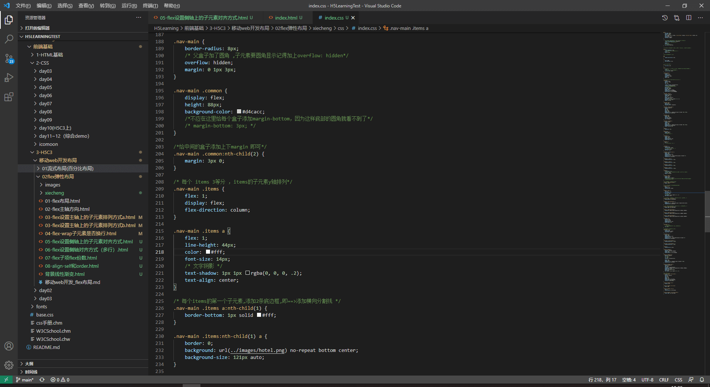
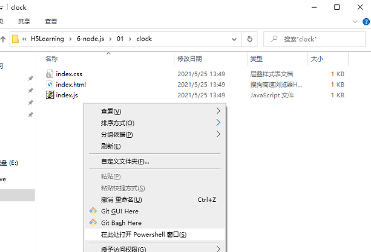

# H5Learning
平时自己学习H5前端相关的测试代码💘💘💘~~  内容包括：H5、CSS3、rem布局适配、JavaScript、jQUery、ajax、node.js、Vue~


### 截图：
   

### 1、快速生成HTML结构语法

- 生成标签 直接输入标签名 按tab键即可   比如  div   然后tab 键， 就可以生成 <div></div>
- 如果想要生成多个相同标签  加上 * 就可以了 比如   div*3  就可以快速生成3个div
- 如果有父子级关系的标签，可以用 >  比如   ul > li就可以了
- 如果有兄弟关系的标签，用  +  就可以了 比如 div+p  
- 如果生成带有类名或者id名字的，  直接写  .demo  或者  #two   tab 键就可以了
- 如果生成的div 类名是有顺序的， 可以用 自增符号  $ 
- 如果想要在生成的标签内部写内容可以用  { }  表示

### 2、快速生成CSS样式语法

CSS 基本采取简写形式即可

​		比如 w200   按tab  可以 生成  width: 200px;

​		比如 lh26px   按tab  可以生成  line-height: 26px;

### 3、快速格式化代码、以及设置
>settings.json 打开方式： 设置--在搜索框里搜索settings.json --点击在settings.json编辑
Vscode  快速格式化代码:   shift+alt+f

也可以设置 当我们 保存页面的时候自动格式化代码:

1）文件 ------.>【首选项】---------->【设置】；

2）搜索emmet.include;

3）在settings.json下的【工作区设置】中添加以下语句：

​		"editor.formatOnType": true,
​		"editor.formatOnSave": true

4）修改默认底部蓝色在settings.json 中添加,自行修改颜色值查看效果

```json
    "workbench.colorCustomizations": {
​        "statusBar.background": "#484848",
​        "statusBar.noFolderBackground": "#0A0A0D",
​        "statusBar.debuggingBackground": "#511f1f"
​    }
```

5）VSCode列编辑 快捷键: 
> VSCode列选择快捷键：```alt+shift+鼠标左键拖动```

### 4、多行注释

多行注释的注释方式如下：

```html
/*
  获取用户年龄和姓名
  并通过提示框显示出来
*/
```

```
/* */  用来注释多行文字（ 默认快捷键  alt +  shift  + a ） 
```

快捷键修改为：   ctrl + shift  +  /

vscode → 首选项按钮 → 键盘快捷方式 → 查找 原来的快捷键 → 修改为新的快捷键 → 回车确认


### 5、vscode js文件中没有jQuery的语法提示?
- 方式一：js文件中顶部require('jQuery')
- 方式二：项目目录下新建一个jsconfig.json文件:
```json
{
  "typeAcquisition": {
      "include": [
          "jquery"
      ]
  }
}
```

### 6、在 Node.js 环境中执行 JavaScript 代码：
  - 在要运行的js文件夹的空白处 按住shitf的同时点击鼠标右键,选择powershell打开，即可快速定位到当前目录下。
  - 安装完node.js后，输入: node 文件名.js(文件名不用输入全，按tab可以补全)  即可快速运行js文件  
  

  - 在 Windows 的 powershell(cmd的升级版) 或 cmd 终端中，以下快捷键可提高终端的操作效率：
    > 1、使用 ↑ 键，可以快速定位到上一次执行的命令
    > 2、使用 tab 键，能够快速补全路径
    > 3、使用 esc 键，能够快速清空当前已输入的命令
    > 4、输入 cls 命令，可以清空终端

  - VScode 里已集成终端、建议使用：终端->新终端-> cd定位到js路径 即可执行。
    在VScode 里启动的node http服务 可以通过 ```ctrl+c``` 停止服务。

### 7、Express 
  > Express是基于 Node.js 平台里内置的http 模块封装的第三方 Web 开发框架，能够极大的提高开发效率。 
  终端定位到 项目所处的目录中安装命令： ```nmp i express```

  - 基本使用：
  ```js
    // 1. 导入 express
  const express = require('express')
  // 2. 创建 web 服务器
  const web = express()

  //http://127.0.0.1:8080/userInfo
  //监听客户端的 GET 和 POST 请求， 并向客户端响应具体的内容
  web.get('/userInfo', (req, res) => {
    let user = {
      name: '阿三',
      age: 22,
      gender: '男'
    }
    // res.send()向客户端响应一个 JSON 对象
    res.send(user)
  })

  web.post('/userInfo', (req, res) => {
    //向客户端响应一个 文本字符串
    res.send('请求成功~')
  })

  //http://127.0.0.1:8080/?age=22&sex=%E7%94%B7
  web.get('/', (req, res) => {
    // 通过 req.query 可以获取到客户端发送过来的 查询参数,req.query 默认是一个空对象
    console.log(req.query)
    res.send(req.query)
  })

  //http: //127.0.0.1:8080/userInfo/2/comme
  //这里的 :ids 是一个动态的参数
  web.get('/userInfo/:ids/:username', (req, res) => {
    // req.params 是动态匹配到的 URL 参数，默认也是一个空对象
    console.log(req.params)
    res.send(req.params)
  })
  // 启动 web 服务器
  web.listen(8080, () => {
    console.log('express server running at http://127.0.0.1:8080')
  }) 
  ``` 
### 8、Node.js 里npm安装的包 
 - npm ,安装的包会在node_modules文件夹下多了包会很大 提交代码时一定要把需要文件夹，添加到 .gitignore 忽略文件中。
 - npm 包管理工具提供了一个快捷命令，``` npm init -y```可以在执行命令时所处的目录中(最好是英文目录)，快速创建 package.json 这个包管理
 - 运行 npm install 命令安装包的时候，npm 包管理工具会自动把包的名称和版本号，记录到 package.json 中。
 - 剔除了 node_modules 的项目之后，需要先把所有的包下载到项目中，才能将项目运行起来。可以运行 npm install 命令（或 ```npm i```）一次性安装所有的依赖包

 ### 9、Node.js 链接MySQL
  - 安装插件``` npm i mysql``` 基本操作如下：
  ```js
  // 1. 导入 mysql 模块
  const mysql = require('mysql')
  // 2. 建立与 MySQL 数据库的连接关系
  const db = mysql.createPool({
  host: '127.0.0.1', // 数据库的 IP 地址
  port: '3306',
  user: 'root', // 登录数据库的账号
  password: 'admin123', // 登录数据库的密码
  database: 'new_schema_01', // 指定操作数据库的名称
  //Node mysql做了安全的限制,想要执行多条sql语句，需要打开对应开关配置
  multipleStatements: true,
  })

  /**
  * 查询 users 表中所有的数据
  */
  function getAllUser() {
    const sqlStr = 'select * from users'
    db.query(sqlStr, (err, results) => {
      // 查询数据失败
      if (err) return console.log(err.message)
      // 查询数据成功
      // 注意：如果执行的是 select 查询语句，则执行的结果是数组
      console.log(results)

      db.end() //不需要继续操作时,关闭
    })
  }

  /**
  * 向 users 表中， 新增一条数据
  */
  function addUser() {
    const user = {
      username: '放点水',
      userpwd: 'pcc123'
    }
    const sqlStr2 = 'insert into users (username, userpwd) values (?, ?)'
    // 执行 SQL 语句
    db.query(sqlStr2, [user.username, user.userpwd], (err, results) => {
      // 执行 SQL 语句失败了
      if (err) return console.log(err.message)
      // 成功了
      // 注意：如果执行的是 insert into 插入语句，则 results 是一个对象
      // 可以通过 affectedRows 属性，来判断是否插入数据成功
      if (results.affectedRows === 1) {
        console.log('插入数据成功!')
        getAllUser()
      }
    })
  }
   ```
  - 关于常见的分页查询实现 mySql最基本的分页方式的条件顺序如下：
   > ```SELECT ... FROM ... WHERE ... ORDER BY ... LIMIT ...``` 
    前端分页请求后台时 传统做法需要查询2次：
    1、查询列表 ```sql SELECT * FROM user WHERE islogin =1; ```
    2、查询该表的总数 ```sql SELECT COUNT(*) as total FROM user WHERE islogin =1;```

   > SQL_CALC_FOUND_ROWS 是mysql的内置关键字，可以记录下当前 sql 的总行数（受where 影响,但不受 limit 影响）
      以下查询 分页数据的同时返回 数据的总数:（看起来是两条SQL语句，但是实际上只执行了一次数据库查询。）

  ```sql
  select SQL_CALC_FOUND_ROWS * from ev_article_list where is_delete = 0 order by id asc limit 0, 2;
  SELECT FOUND_ROWS() as total; 
  ```

  - 实际运用举例：
  ```js
  // 根据条件筛选分页 获取文章列表
  exports.getArtCateList = (req, res) => {
    let status = req.query.status
    let cate_id = req.query.cate_id

    let extra_sql //额外的查询条件,非必传的参数
    if (status) extra_sql = ` and status=${status} `
    if (cate_id) extra_sql += ` and cate_id=${cate_id} `
    // 定义根据 ID 获取文章分类数据的 SQL 语句
    let pagenum = req.query.pagenum //前端请求第几页
    let pagesize = parseInt(req.query.pagesize) 
    let start = 0
    //pagenum 是从1开始
    if (pagenum > 1) {
      start = (pagenum - 1) * pagesize
    }

    // limit 5,10，0开始计数，从第5条数据开始查询10条数据  即查询第6~15条数据,      
    console.log(`select * from ev_article_list where is_delete=0 order by id asc limit ${start},${pagesize}`);

    //没有额外查询条件的sql 语句:
    let sql = `select SQL_CALC_FOUND_ROWS * from ev_article_list where is_delete=0 order by id asc limit ${start},${pagesize};SELECT FOUND_ROWS() as total;`
    if (extra_sql) {
      console.log(`extra_sql===${extra_sql}`);
      sql = `select SQL_CALC_FOUND_ROWS * from ev_article_list where is_delete=0${extra_sql}order by id asc limit ${start},${pagesize};SELECT FOUND_ROWS() as total;`
    }
    console.log(`分页文章查询sql==========>${sql}`);

    db.query(sql, (err, results) => {
      if (err) return res.cc(err)
      //注意 此时results 数组会返回2个item ，第一个item 是查询到了文章列表集合，第二个item 是查询到的总数集合 里面就一个total:
      console.log(results);
      /*   [
            [
              RowDataPacket {
                id: 4,
                title: 'a12',
                cate_name: '测试3',
                time: '1622801132703',
                status: 0,
                content: '123房贷',
                cate_id: 0,
                cover_img: null,
                author_id: 0,
                is_delete: 0
              },
              RowDataPacket {
                id: 5,
                title: 'a12',
                cate_name: '测试4',
                time: '1622801132703',
                status: 1,
                content: '释放',
                cate_id: 0,
                cover_img: null,
                author_id: 0,
                is_delete: 0
              }
            ],
            [RowDataPacket {
              total: 3
            }]
          ] */
      const responseObj = {
        status: 0,
        message: '获取文章列表成功！',
        data: results[0],
        total: results[1][0].total,
      }
      res.send(responseObj)
    })
  }
  ```
  ##### MySQL导出数据库文件：
  > 1、进入MySQL目录下的bin文件夹：cd MySQL中到bin文件夹的目录: 
       cd C:\Program Files\MySQL\MySQL Server 8.0\bin 

    2、导出数据库：mysqldump -u 用户名 -p 数据库名 > 导出的文件名:
       mysqldump -u root -p jluibmclub > d:\ jluibmclub .sql(回车后输入MySQL的密码) 

  > 或者在mysql顶端选项卡Server -->DataExport -->勾选Export to self-Contained File -->Start Export
  


   