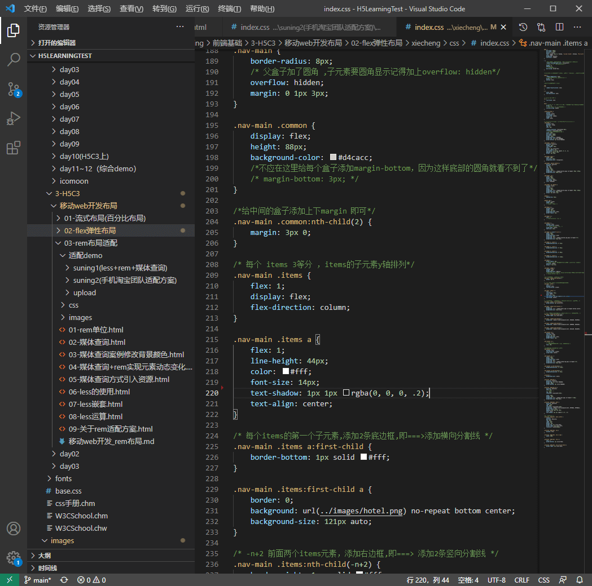

# H5Learning
平时学习H5前端相关的测试代码~~~💘💘💘


###### 截图：
   
   
###### 1、快速生成HTML结构语法

- 生成标签 直接输入标签名 按tab键即可   比如  div   然后tab 键， 就可以生成 <div></div>
- 如果想要生成多个相同标签  加上 * 就可以了 比如   div*3  就可以快速生成3个div
- 如果有父子级关系的标签，可以用 >  比如   ul > li就可以了
- 如果有兄弟关系的标签，用  +  就可以了 比如 div+p  
- 如果生成带有类名或者id名字的，  直接写  .demo  或者  #two   tab 键就可以了
- 如果生成的div 类名是有顺序的， 可以用 自增符号  $ 
- 如果想要在生成的标签内部写内容可以用  { }  表示

###### 2、快速生成CSS样式语法

CSS 基本采取简写形式即可

​		比如 w200   按tab  可以 生成  width: 200px;

​		比如 lh26px   按tab  可以生成  line-height: 26px;

###### 3、快速格式化代码、以及设置
>settings.json 打开方式： 设置--在搜索框里搜索settings.json --点击在settings.json编辑
Vscode  快速格式化代码:   shift+alt+f

也可以设置 当我们 保存页面的时候自动格式化代码:

1）文件 ------.>【首选项】---------->【设置】；

2）搜索emmet.include;

3）在settings.json下的【工作区设置】中添加以下语句：

​		"editor.formatOnType": true,
​		"editor.formatOnSave": true


4）修改默认底部蓝色在settings.json 中添加,自行修改颜色值查看效果
    ```
    "workbench.colorCustomizations": {
        "statusBar.background": "#484848",
        "statusBar.noFolderBackground": "#0A0A0D",
        "statusBar.debuggingBackground": "#511f1f"
    }
    ```

###### 4、VSCode列编辑 快捷键:

◾VSCode列选择快捷键：alt+shift+鼠标左键拖动
