# css第二天

## 一、emmet语法

### 1、简介

​		Emmet语法的前身是Zen coding,它使用缩写,来提高html/css的编写速度, Vscode内部已经集成该语法。

​		快速生成HTML结构语法

​		快速生成CSS样式语法

### 2、快速生成HTML结构语法

- 生成标签 直接输入标签名 按tab键即可   比如  div   然后tab 键， 就可以生成 <div></div>
- 如果想要生成多个相同标签  加上 * 就可以了 比如   div*3  就可以快速生成3个div
- 如果有父子级关系的标签，可以用 >  比如   ul > li就可以了
- 如果有兄弟关系的标签，用  +  就可以了 比如 div+p  
- 如果生成带有类名或者id名字的，  直接写  .demo  或者  #two   tab 键就可以了
- 如果生成的div 类名是有顺序的， 可以用 自增符号  $ 
- 如果想要在生成的标签内部写内容可以用  { }  表示

### 3、快速生成CSS样式语法

CSS 基本采取简写形式即可

​		比如 w200   按tab  可以 生成  width: 200px;

​		比如 lh26px   按tab  可以生成  line-height: 26px;

### 4、快速格式化代码

Vscode  快速格式化代码:   shift+alt+f

也可以设置 当我们 保存页面的时候自动格式化代码:

1）文件 ------.>【首选项】---------->【设置】；

2）搜索emmet.include;

3）在settings.json下的【工作区设置】中添加以下语句：

​		"editor.formatOnType": true,

​		"editor.formatOnSave": true

## 二、css的复合选择器

### 1、什么是复合选择器？

​		在 CSS 中，可以根据选择器的类型把选择器分为***基础选择器***和***复合选择器***，复合选择器是建立在基础选择器之上，对基本选择器进行组合形成的。 
​		复合选择器是由两个或多个基础选择器，通过不同的方式组合而成的，可以更准确、更高效的选择目标元素（标签）
​		常用的复合选择器包括：**后代选择器、子选择器、并集选择器、伪类选择器**等等

### 2、后代选择器 (重要）

**定义：**

​		后代选择器又称为包含选择器，可以选择父元素里面子元素。其写法就是把外层标签写在前面，内层标签写在后面，中间用空格分隔。当标签发生嵌套时，内层标签就成为外层标签的后代。

**语法：**


​		上述语法表示选择元素 1 里面的所有元素 2 (后代元素)。

**语法说明**：

- 元素1 和 元素2 中间用空格隔开
- 元素1 是父级，元素2 是子级，最终选择的是元素2
- 元素2 可以是儿子，也可以是孙子等，只要是元素1 的后代即可
- 元素1 和 元素2 可以是任意基础选择器

**例子：**

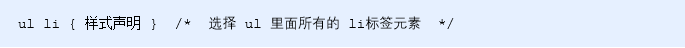

### 3、子选择器 (重要）

**定义：**

​		子元素选择器（子选择器）只能选择作为某元素的最近一级子元素。

​		（简单理解就是选亲儿子元素）

**语法：**

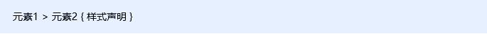

​		上述语法表示选择元素1 里面的所有直接后代(子元素) 元素2。

**语法说明**：

- 元素1 和 元素2 中间用 大于号 隔开
- 元素1 是父级，元素2 是子级，最终选择的是元素2
- 元素2 必须是亲儿子，其孙子、重孙之类都不归他管. 你也可以叫他 亲儿子选择器

**例子：**

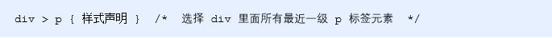

### 4、并集选择器 (重要）

**定义：**

​		并集选择器可以选择多组标签, 同时为他们定义相同的样式，通常用于集体声明。并集选择器是各选择器通过英文逗号（,）连接而成，任何形式的选择器都可以作为并集选择器的一部分。

**语法：**

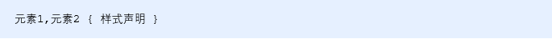

​		上述语法表示选择元素1 和 元素2。

**语法说明**：

- 元素1 和 元素2 中间用逗号隔开
- 逗号可以理解为和的意思
- 并集选择器通常用于集体声明

**例子：**

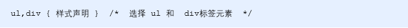

### 5、伪类选择器

**定义：**

​		伪类选择器用于向某些选择器添加特殊的效果，比如给链接添加特殊效果，或选择第1个，第n个元素。

**语法：**

​		伪类选择器书写最大的特点是用冒号（:）表示，比如 :hover 、 :first-child 。


### 6、链接伪类选择器

**定义：**

​		伪类选择器用于向某些选择器添加特殊的效果，比如给链接添加特殊效果，或选择第1个，第n个元素。

**语法：**

​		伪类选择器书写最大的特点是用冒号（:）表示，比如 :hover 、 :first-child 。

​		a:link	没有点击过的(访问过的)链接
​		a:visited	点击过的(访问过的)链接
​		a:hover	鼠标经过的那个链接
​		a:active	鼠标正在按下还没有弹起鼠标的那个链接

**链接伪类选择器注意事项**

​		为了确保生效，请按照 LVHA 的循顺序声明 :link－:visited－:hover－:active。

​		记忆法：love hate 或者 lv 包包 hao 。

​		因为 a 链接在浏览器中具有默认样式，所以我们实际工作中都需要给链接单独指定样式。

**链接伪类选择器实际工作开发中的写法**：

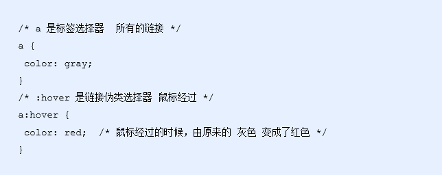


### 7、:focus 伪类选择器

**定义：**

​		:focus 伪类选择器用于选取获得焦点的表单元素。

​		焦点就是光标，一般情况 <input> 类表单元素才能获取

例子：

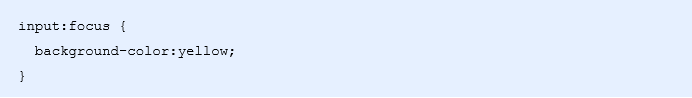


### 复合选择器总结

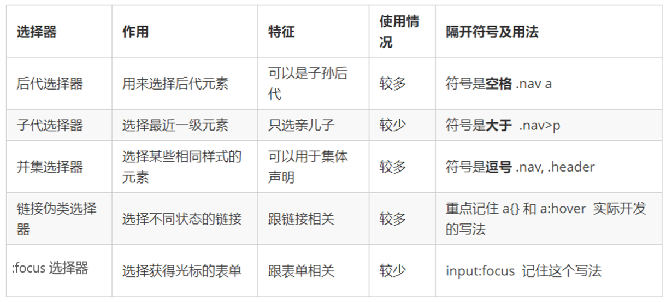

## 三、css的显示模式

### 1、什么是元素的显示模式

**定义：**

​		元素显示模式就是元素（标签）以什么方式进行显示，比如<div>自己占一行，比如一行可以放多个<span>。

**作用：**

​		网页的标签非常多，在不同地方会用到不同类型的标签，了解他们的特点可以更好的布局我们的网页。

### 2、元素显示模式的分类

#### 2.1、块元素

**常见的块元素**：

```
<h1>~<h6>、<p>、<div>、<ul>、<ol>、<li>
```

​		<div> 标签是最典型的块元素。

**块级元素的特点**：

- 比较霸道，自己独占一行。
- 高度，宽度、外边距以及内边距都可以控制。
- 宽度默认是容器（父级宽度）的100%。
- 是一个容器及盒子，里面可以放行内或者块级元素。


**注意：**

​		文字类的元素内不能放块级元素

```
<p> 标签主要用于存放文字，因此 <p> 里面不能放块级元素，特别是不能放<div> 
同理， <h1>~<h6>等都是文字类块级标签，里面也不能放其他块级元素
```


#### 2.2、行内元素

**常见的行内元素：**

```
<a>、<strong>、<b>、<em>、<i>、<del>、<s>、<ins>、<u>、<span>
```

​		<span> 标签是最典型的行内元素。有的地方也将行内元素称为内联元素。


**行内元素的特点：**

- 相邻行内元素在一行上，一行可以显示多个。

- 高、宽直接设置是无效的。

- 默认宽度就是它本身内容的宽度。

- 行内元素只能容纳文本或其他行内元素。


**注意：**
		链接里面不能再放链接
		特殊情况链接 <a> 里面可以放块级元素，但是给 <a> 转换一下块级模式最安全


#### 2.3、行内块元素

**常见的行内块标签**：

```
、<input />、<td>
```

​		它们同时具有块元素和行内元素的特点。有些资料称它们为行内块元素。

**行内块元素的特点**：

- 和相邻行内元素（行内块）在一行上，但是他们之间会有空白缝隙。
- 一行可以显示多个（行内元素特点）。
- 默认宽度就是它本身内容的宽度（行内元素特点）。
- 高度，行高、外边距以及内边距都可以控制（块级元素特点）。

#### 2.4、元素显示模式总结

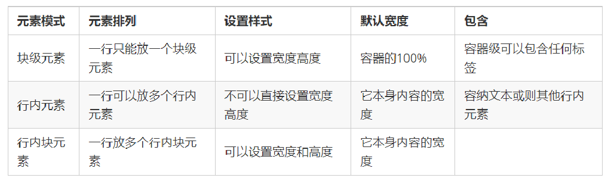

​		学习元素显示模式的主要目的就是分清它们各自的特点，当我们网页布局的时候，在合适的地方用合适的标签元素。

### 3、元素显示模式的转换

**简单理解**: 

​		一个模式的元素需要另外一种模式的特性
​		比如想要增加链接 <a> 的触发范围。   

**转换方式**

- 转换为块元素：display:block;
- 转换为行内元素：display:inline;
- 转换为行内块：display: inline-block;

### 4、单行文字垂直居中的代码

**解决方案**:    

​		让文字的行高等于盒子的高度  就可以让文字在当前盒子内垂直居中


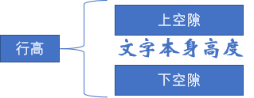

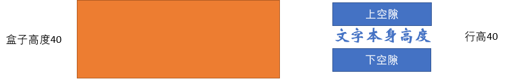


**简单理解**: 

​		行高的上空隙和下空隙把文字挤到中间了，

​		如果行高小于盒子高度,文字会偏上，

​		如果行高大于盒子高度,则文字偏下。


## 四、css的背景

通过 CSS 背景属性，可以给页面元素添加背景样式。
背景属性可以设置背景颜色、背景图片、背景平铺、背景图片位置、背景图像固定等。

### 1、背景颜色

**样式名称**：

​		background-color 定义元素的背景颜色

**使用方式**：

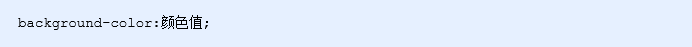

**其他说明**：

​		元素背景颜色默认值是 transparent（透明）

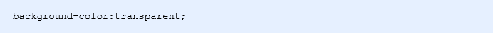

### 2、背景图片

**样式名称**：

​		background-image  定义元素的背景图片

**使用方式**：

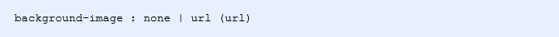

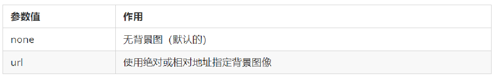

**其他说明**：

​		实际开发常见于 logo 或者一些装饰性的小图片或者是超大的背景图片, 优点是非常便于控制位置. (精灵图也是一种运用场景)

​		注意：背景图片后面的地址，千万不要忘记加 URL， 同时里面的路径**不要加引号**。


### 3、背景平铺

**样式名称：**

​		background-repeat 设置元素背景图像的平铺 

**使用方式：**

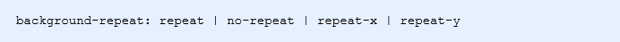

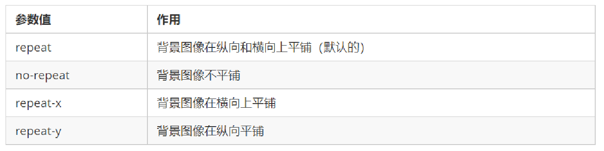

### 4、背景图片位置

**样式名称：**

​		background-position 属性可以改变图片在背景中的位置

**使用方式：**

​		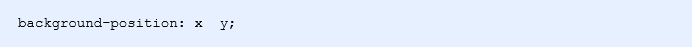

​		参数代表的意思是：x 坐标和 y 坐标。 可以使用 方位名词 或者 精确单位

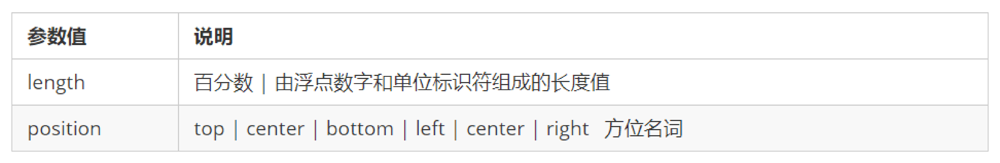

**其他说明：**

1、参数是方位名词

​		如果指定的两个值都是方位名词，则两个值前后顺序无关，比如 left  top 和 top  left 效果一致

​		如果只指定了一个方位名词，另一个值省略，则第二个值默认居中对齐

2、参数是精确单位

​		如果参数值是精确坐标，那么第一个肯定是 x 坐标，第二个一定是 y 坐标

​		如果只指定一个数值，那该数值一定是 x 坐标，另一个默认垂直居中

3、参数是混合单位

​		如果指定的两个值是精确单位和方位名词混合使用，则第一个值是 x 坐标，第二个值是 y 坐标

### 5、背景图片固定

**样式名称：**

​		background-attachment 属性设置背景图像是否固定或者随着页面的其余部分滚动。

**使用方式：**

​		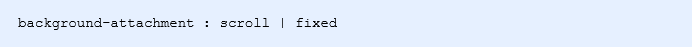

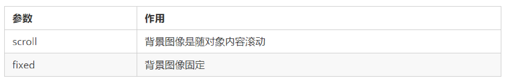

**其他说明：**

​		background-attachment 后期可以制作视差滚动的效果。

### 6、背景样式合写

**背景合写样式：**

​		background: 背景颜色 背景图片地址 背景平铺 背景图像滚动 背景图片位置;

**使用方式：**

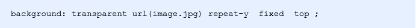

### 7、背景色半透明

CSS3 提供了背景颜色半透明的效果。 

**使用方式：**

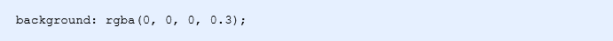

- 最后一个参数是 alpha 透明度，取值范围在 0~1之间
- 我们习惯把 0.3 的 0 省略掉，写为 background: rgba(0, 0, 0, .3);

**注意**：

- 背景半透明是指盒子背景半透明，盒子里面的内容不受影响
- CSS3 新增属性，是 IE9+ 版本浏览器才支持的，但是现在实际开发,我们不太关注兼容性写法了,可以放心使用

### 8、背景总结

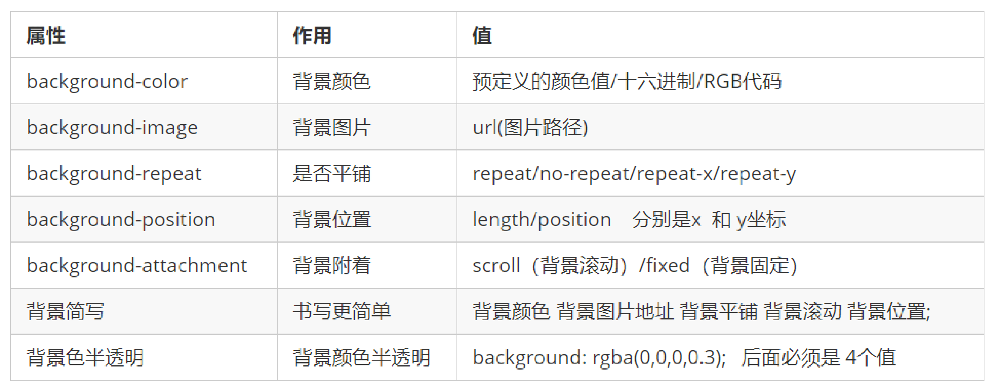