##HTML第一天
###我们接下来是进行的网页开发网页的相关概念:
+  什么是网页?
+  什么是HTML?
+  网页的形成?
##什么是网页：
    1.网站是指在因特网上根据一定的规则，使用 HTML 等制作的用于展示特定内容相关的网页集合。
    2.网页是网站中的一“页”，通常是 HTML 格式的文件，它要通过浏览器来阅读。
###网页的组成：
    1.网页是构成网站的基本元素，它通常由图片、链接、文字、声音、视频等元素组成。通常我们看到的网页，常见以 .htm 或 .html 后缀结尾的文件，因此将其俗称为 HTML 文件。
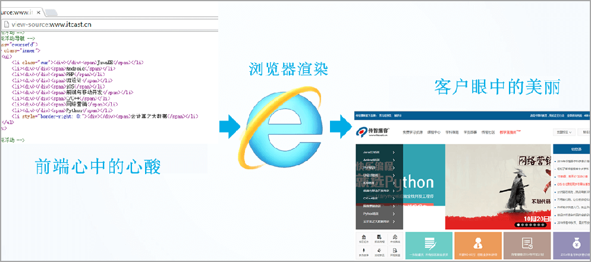
###什么是HTML：
    1.HTML 指的是超文本标记语言 (Hyper Text Markup Language) ，它是用来描述网页的一种语言。
    2.HTML 不是一种编程语言，而是一种标记语言 (markup language)。
    标记语言是一套标记标签 (markup tag)。
###网页的总结：
    1.网页是图片、链接、文字、声音、视频等元素组成, 其实就是一个html文件(后缀名为html)
    2.网页生成制作:  有前端人员书写 HTML 文件, 然后浏览器打开,就能看到了网页.
    3.HTML: 超文本标记语言, 用来制作网页的一门语言. 有标签组成的. 比如 图片标签 链接标签 视频标签等…
###浏览器：
**常用的浏览器**
+  IE
+  火狐
+  谷歌
+  苹果
+  欧朋
-  浏览器是网页显示、运行的平台。常用的浏览器有 IE、火狐（Firefox）、谷歌（Chrome）、Safari和Opera等。平时称为五大浏览器。
-  查看浏览器市场份额：http://tongji.baidu.com/data/browser
  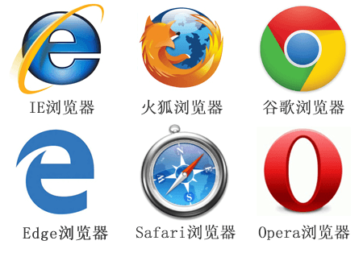
  **浏览器内核（渲染引擎）**
+  负责读取网页内容，整理讯息，计算网页的显示方式并显示页面
  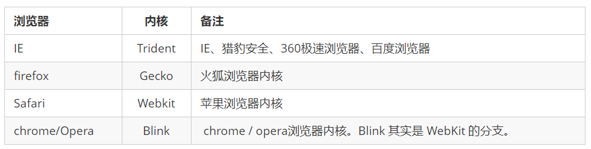
+  目前国内一般浏览器都会采用 Webkit/Blink 内核，如 360、UC、QQ、搜狗等。
##web标准：
+  Web 标准是由 W3C 组织和其他标准化组织制定的一系列标准的集合。W3C（万维网联盟）是国际最著名的标准化组织。
###为什么需要Web标准：
+  浏览器不同，它们显示页面或者排版就有些许差异
  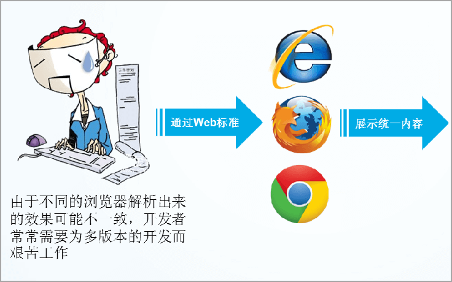

+  遵循 Web 标准除了可以让不同的开发人员写出的页面更标准、更统一外，还有以下优点：
    1.让 Web 的发展前景更广阔。 
    2.内容能被更广泛的设备访问。
    3.更容易被搜寻引擎搜索。
    4.降低网站流量费用。
    5.使网站更易于维护。
    6.提高页面浏览速度。
##web标准的构成：
    主要包括 《结构Structure》 、《表现（Presentation）》和《行为（Behavior）》三个方面。
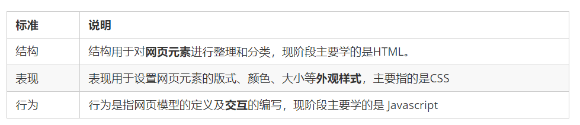
Web 标准提出的最佳体验方案：**结构、样式、行为相分离**。  
简单理解：**结构写到 HTML 文件中， 表现写到 CSS 文件中， 行为写到 JavaScript 文件中**
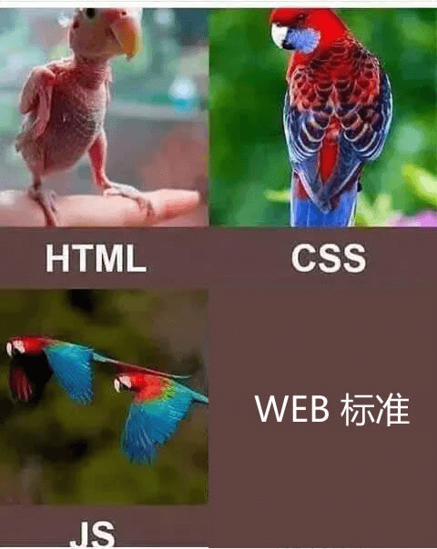

1.结构类似身体

2.表现类似外观装饰

3.行为类似行为动作

4.相比较而言, 三者中结构最重要.
##HTML标签的导读：
###HTML语法规则：
    1.HTML 标签是由尖括号包围的关键词，例如 <html>。
    2.HTML 标签通常是成对出现的，例如 <html> 和 </html> ，我们称为**双标签**。
    3.签。标签对中的第一个标签是开始标签，第二个标签是结束标签。 
有些特殊的标签必须是单个标签（极少情况），例如  ，我们称为**单标签**。  
###标签的关系：
    双标签关系可以分为两类：包含关系和并列关系
    包含标签：
        <head>  
            <title> </title> 
        </head>
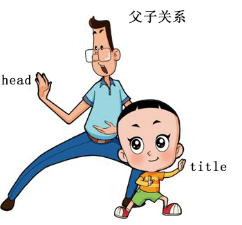 
    并列关系：
         <head> </head>
         <body> </body>
 
###基本结构标签：
    每个网页都会有一个基本的结构标签（也称为骨架标签），页面内容也是在这些基本标签上书写
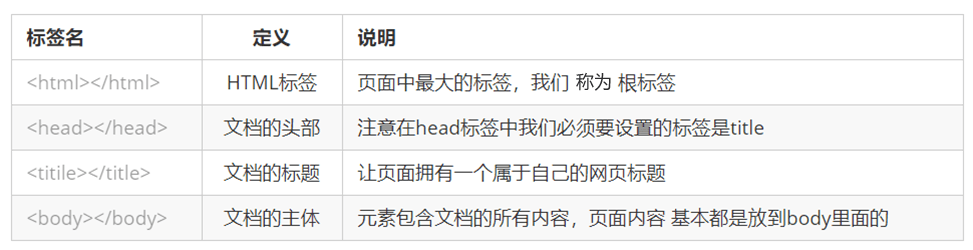 
###开发工具：
   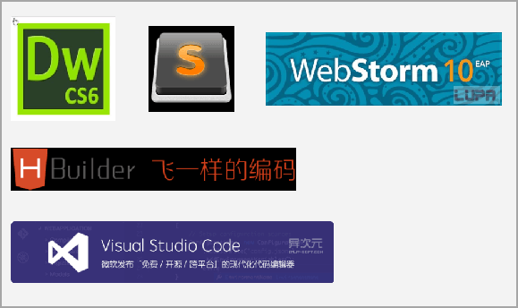 
    
**VSCode的使用：**
    1. 双击打开软件。
    2. 新建文件（Ctrl + N ）。
    3. 保存（Ctrl + S ）, 注意移动要保存为 .html 文件
    4. Ctrl + 加号键 ，Ctrl + 减号键  可以放大缩小视图 
    5. 生成页面骨架结构。 输入! 按下 Tab 键。
    6. 利用插件在浏览器中预览页面：单击鼠标右键，在弹出窗口中点击“Open In Default Browser”。
**DOCTYPE**
    <!DOCTYPE html>  文档类型声明标签,告诉浏览器这个页面采取html5版本来显示页面.
**lang 语言种类**
    用来定义当前文档显示的语言。
    en定义语言为英语
    zh-CN定义语言为中文
    简单来说,定义为en 就是英文网页, 定义为 zh-CN 就是中文网页
    其实对于文档显示来说，定义成en的文档也可以显示中文，定义成zh-CN的文档也可以显示英文
    这个属性对浏览器和搜索引擎(百度.谷歌等)还是有作用的
**字符集**
    1.字符集 (Character set)是多个字符的集合。以便计算机能够识别和存储各种文字。
    2.在<head>标签内，可以通过<meta> 标签的 charset 属性来规定 HTML 文档应该使用哪种字符编码。
    3.<meta charset=" UTF-8" />
    4.charset 常用的值有：GB2312 、BIG5 、GBK 和 UTF-8，其中 UTF-8 也被称为万国码，基本包含了全世界所有国家需要用到的字符.
    5.注意：上面语法是必须要写的代码，否则可能引起乱码的情况。一般情况下，统一使用“UTF-8”编码，尽量统一写成标准的 "UTF-8"，不要写成  "utf8" 或 "UTF8"。
###语义化标签：
    学习标签是有技巧的，重点是记住每个标签的语义。简单理解就是指标签的含义，即这个标签是用来干嘛的。
###什么是语义化标签：
    根据标签的语义，在合适的地方给一个最为合理的标签，可以让页面结构更清晰。
    下图没有语义化标签：
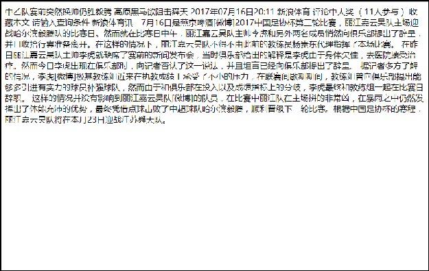
###添加语义标签：
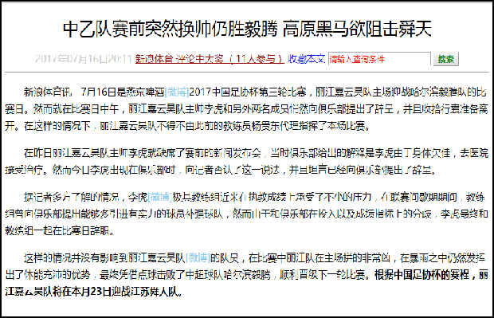
###常用的标签：
###标题标签
    **标题标签 <h1> - <h6>（重要）**
    为了使网页更具有语义化，我们经常会在页面中用到标题标签。HTML 提供了 6 个等级的网页标题，即<h1> - <h6> 。
    具体实现：
          <h1> 我是一级标题 </h1>
    特点：
    1.加了标题的文字会变的加粗，字号也会依次变大。
    2. 一个标题独占一行。
    来！！！左边。。。右边。。。中间：
        <h1>标题一共六级选,</h1>
        <h2>文字加粗一行显。</h2>
        <h3>由大到小依次减，</h3>
        <h4>从重到轻随之变。</h4>
        <h5>语法规范书写后，</h5>
        <h6>具体效果刷新见。</h6>
　　                ------pink老师
###段落标签：
    在网页中，要把文字有条理地显示出来，就需要将这些文字分段显示。在 HTML 标签中，
标签用于定义段落，它可以将整个网页分为若干个段落。
    具体实现：
         
 我是一个段落标签 

    特点：
        1. 文本在一个段落中会根据浏览器窗口的大小自动换行。
        2. 段落和段落之间保有空隙。
###换行标签
    在 HTML 中，一个段落中的文字会从左到右依次排列，直到浏览器窗口的右端，然后才自动换行。如果希望某段文本强制换行显示，就需要使用换行标签  。
    具体实现：
           
    特点：
        1.   是个单标签。
        2.   标签只是简单地开始新的一行，跟段落不一样，段落之间会插入一些垂直的间距。
###文本格式化标签：
    在网页中，有时需要为文字设置粗体、斜体 或下划线等效果，这时就需要用到 HTML 中的文本格式化标签，使文字以特殊的方式显示。
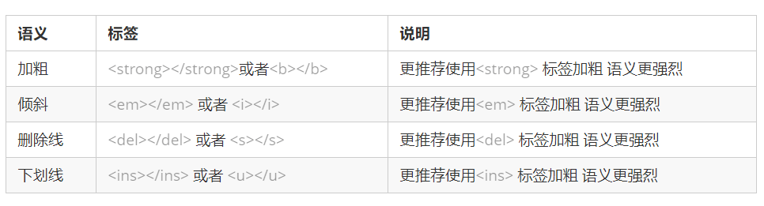
###div和span标签
    
 和  是没有语义的，它们就是一个盒子，用来装内容的。
    具体实现：
         
 这是头部 
    
          今日价格 
    特点：
        1. 
 标签用来布局，但是现在一行只能放一个
。 大盒子
        2.  标签用来布局，一行上可以多个 。小盒子
###图片标签：
    在 HTML 标签中， 标签用于定义 HTML 页面中的图像。
    具体实现：
          
    解释：
        src 是标签的必须属性，它用于指定图像文件的路径和文件名。
        所谓属性：简单理解就是属于这个图像标签的特性。
    图像标签的其他属性：
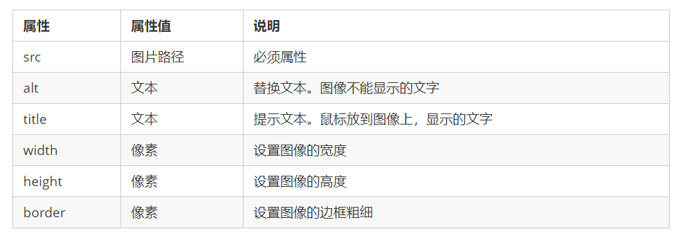 
​    
    图像标签注意点：
        1.图像标签可以拥有多个属性，必须写在标签名的后面。
        2.属性之间不分先后顺序，标签名与属性、属性与属性之间均以空格分开。
        3.属性采取键值对的格式，即 key=“value" 的格式，属性 =“属性值”。
###路径：
    分为相对路径和绝对路径：
        **路径之相对路径**
        相对路径：以引用文件所在位置为参考基础，而建立出的目录路径。 
        这里简单来说，图片相对于 HTML 页面的位置
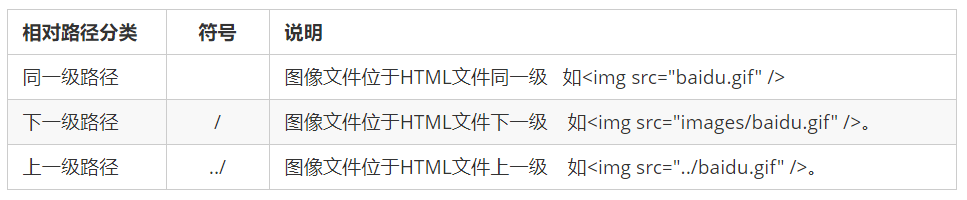 
    特点：
        相对路径是从代码所在的这个文件出发，去寻找目标文件的，而我们这里所说的上一级 、下一级和同一级就是 图片相对于 HTML 页面的位置。
        路径之绝对路径：
            绝对路径：
            1.是指目录下的绝对位置，直接到达目标位置，通常是从盘符开始的路径。
            例如，“D:\web\img\logo.gif”或完整的网络地址“http://www.itcast.cn/images/logo.gif”
###链接标签：
     链接的语法格式
        <a href="跳转目标" target="目标窗口的弹出方式"> 文本或图像 </a>
    属性：
        1.href：用于指定链接目标的url地址
        2.target:用于指定链接页面的打开方式_self默认值 _blank新窗口打开
        3.#：空链接
链接分类：
    1.外部链接: 例如 < a href="http:// www.baidu.com "> 百度</a >。
    2.内部链接:网站内部页面之间的相互链接. 直接链接内部页面名称即可，例如 < a href="index.html"> 首页 </a >。
    3.空链接: 如果当时没有确定链接目标时，< a href="#"> 首页 </a > 。
    4.下载链接: 如果 href 里面地址是一个文件或者压缩包，会下载这个文件。
    5.网页元素链接: 在网页中的各种网页元素，如文本、图像、表格、音频、视频等都可以添加超链接.
    6.锚点链接:  点我们点击链接,可以快速定位到页面中的某个位置. 
+        在链接文本的 href 属性中，设置属性值为 #名字 的形式，如<a href="#two"> 第2集 </a> 
+        找到目标位置标签，里面添加一个 id 属性 = 刚才的名字 ，如：<h3 id="two">第2集介绍</h3>
###注释
    如果需要在 HTML 文档中添加一些便于阅读和理解但又不需要显示在页面中的注释文字，就需要使用注释标签。
HTML中的注释以“<!--”开头，以“ -->”结束。
    具体实现：
         <!-- 注释语句 -->      快捷键: ctrl +  / 
    一句话: 注释标签里面的内容是给程序猿看的, 这个代码是不执行不显示到页面中的.
    添加注释是为了更好地解释代码的功能，便于相关开发人员理解和阅读代码，程序是不会执行注释内容的
###特殊字符：
    在 HTML 页面中，一些特殊的符号很难或者不方便直接使用，此时我们就可以使用下面的字符来替代。
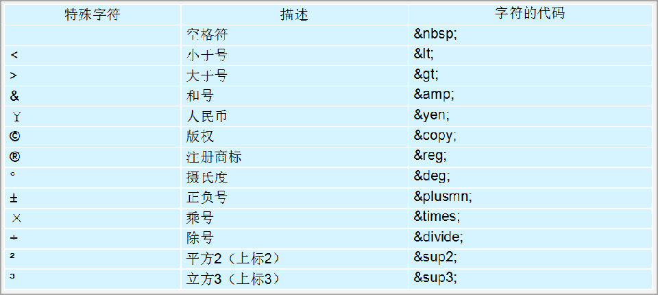 
    重点记住：空格 、大于号、 小于号 这三个， 其余的使用很少，如果需要回头查阅即可。

