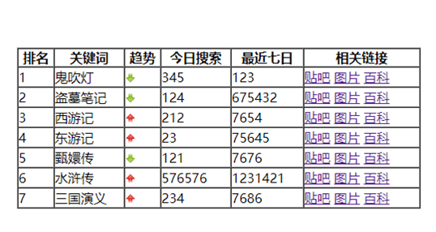
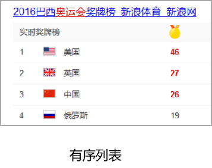
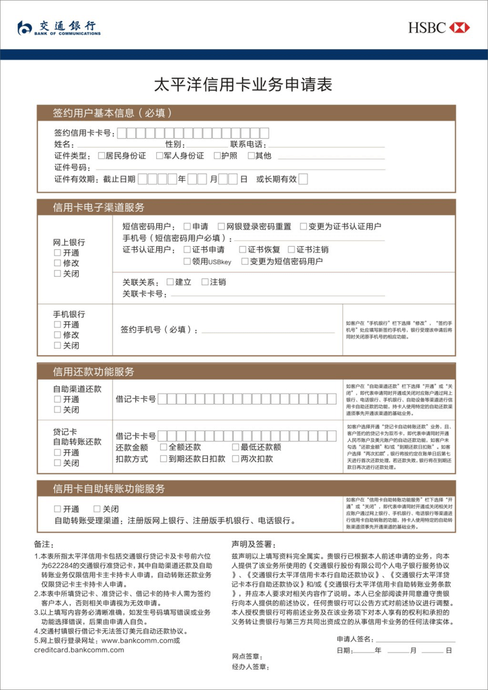

##第二天
##表格
###表格的主要作用
    1.表格主要用于显示、展示数据，因为它可以让数据显示的非常的规整，可读性非常好。特别是后台展示数据的时候，能够熟练运用表格就显得很重要。一个清爽简约的表格能够把繁杂的数据表现得很有条理

    2.表格不是用来布局页面的,而是用来展示数据的。

​    
    3.表格的具体用法：
         <table>
            <tr>
                <td>单元格内的文字</td>
                ...
            </tr>
            ...
        </table>
        1.<table> </table> 是用于定义表格的标签。
        2.<tr> </tr> 标签用于定义表格中的行，必须嵌套在 <table> </table>标签中。
        3.<td> </td> 用于定义表格中的单元格，必须嵌套在<tr></tr>标签中。
        4.字母 td 指表格数据（table data），即数据单元格的内容。
###表头单元格标签：
        表头标签的具体实现：
         <table>
            <tr>
                <th>姓名</th>
                ...
            </tr>
            ...
        </table>
        1.一般表头单元格位于表格的第一行或第一列，表头单元格里面的文本内容加粗居中显示.
            <th> 标签表示 HTML 表格的表头部分(table head 的缩写)
        2.一般表头单元格位于表格的第一行或第一列，表头单元格里面的文本内容加粗居中显示.
            <th> 标签表示 HTML 表格的表头部分(table head 的缩写)
    5.表头单元格也是单元格，常用于表格第一行突出重要性，表头单元格里面的文字会加粗居中
###表格属性：
    1.表格标签这部分属性我们实际开发我们不常用，后面通过 CSS 来设置.
​        
    完成下面综合案例：

​    

​    **思路：**

**先制作表格的结构.**  

1.第一行里面是 th 表头单元格

2.第二行开始里面是 td 普通单元格单元格里面可以放任何元素

3.文字链接图片等都可以

**后书写表格属性**

1.用到宽度高度边框cellpadding 和 cellspacing

2.表格浏览器中对齐 align   
###表格结构标签：
    使用场景:
        因为表格可能很长,为了更好的表示表格的语义，可以将表格分割成 表格头部和表格主体两大部分.
    在表格标签中，分别用：<thead>标签 表格的头部区域、<tbody>标签 表格的主体区域. 这样可以更好的分清表格结构。

**总结:**
    1. <thead></thead>：用于定义表格的头部。<thead> 内部必须拥有 <tr> 标签。 一般是位于第一行。
    2. <tbody></tbody>：用于定义表格的主体，主要用于放数据本体 。
    3.  以上标签都是放在 <table></table> 标签中。
###合并单元格：
    特殊情况下,可以把多个单元格合并为一个单元格,  这里同学们会最简单的合并单元格即可.
    1.合并单元格方式
    2.目标单元格
    3.合并单元格的步骤
    如下图：

**合并单元格方式：**

**跨行合并**：rowspan="合并单元格的个数"     

​	最上侧单元格为目标单元格, 写合并代码

 **跨列合并**：colspan="合并单元格的个数"

​	最左侧单元格为目标单元格, 写合并代码

**合并单元格三步曲：**

先确定是跨行还是跨列合并。

找到目标单元格. 写上合并方式 = 合并的单元格数量。

比如：<td colspan=“2”></td>。删除多余的单元格。

**表格总结**

​	表格学习整体可以分为三大部分:

**表格的相关标签**

​	table   thead  body  tr  th  td 

**表格的相关属性**

​	cellspacing    cellpadding     width  height  border 

**合并单元格**

​	  rowspan   collspan
##列表
    表格是用来显示数据的，那么列表就是用来布局的。 
    列表最大的特点就是整齐、整洁、有序，它作为布局会更加自由和方便。
    根据使用情景不同，列表可以分为三大类：无序列表、有序列表和自定义列表。
###无序：

​	

`<ul>` 标签表示 HTML 页面中项目的无序列表，一般会以项目符号呈现列表项，而列表项使用 <li> 标签定义。无序列表的基本语法格式如下：
   <ul> 

  <li>列表项1</li>   <li>列表项2</li>   <li>列表项3</li>   ... 

</ul>

1. 无序列表的各个列表项之间没有顺序级别之分，是并列的。
2. <ul></ul> 中只能嵌套 <li></li>，直接在 <ul></ul> 标签中输入其他标签或者文字的做法是不被允许的。
3. <li> 与 </li> 之间相当于一个容器，可以容纳所有元素。
4. 无序列表会带有自己的样式属性，但在实际使用时，我们会使用 CSS 来设置。

###有序：

​	

有序列表即为有排列顺序的列表，其各个列表项会按照一定的顺序排列定义。在 HTML 标签中，<ol> 标签用于定义有序列表，列表排序以数字来显示，并且使用 <li> 标签来定义列表项。有序列表的基本语法格式如下：

<ol>   <li>列表项1</li>   <li>列表项2</li>   <li>列表项3</li>   ... </ol>

1. <ol></ol>中只能嵌套<li></li>，直接在<ol></ol>标签中输入其他标签或者文字的做法是不被允许的。
2. <li> 与 </li>之间相当于一个容器，可以容纳所有元素。
3. 有序列表会带有自己样式属性，但在实际使用时，我们会使用 CSS 来设置。

###自定义：

自定义列表的使用场景:自定义列表常用于对术语或名词进行解释和描述，定义列表的列表项前没有任何项目符号。在 HTML 标签中，<dl> 标签用于定义描述列表（或定义列表），该标签会与 <dt>（定义项目/名字）和 <dd>（描述每一个项目/名字）一起使用。语法如下：

 <dl>   <dt>名词1</dt>   <dd>名词1解释1</dd>   <dd>名词1解释2</dd> </dl>

###列表总结

##表单
现实中的表单：

###为什么需要表单：
    使用表单目的是为了收集用户信息。
    在我们网页中， 我们也需要跟用户进行交互，收集用户资料，此时就需要表单。
###表单的组成：
    在 HTML 中，一个完整的表单通常由表单域、表单控件（也称为表单元素）和 提示信息3个部分构成。
###表单域：
    表单域是一个包含表单元素的区域。
    在 HTML 标签中， <form> 标签用于定义表单域，以实现用户信息的收集和传递。
    <form> 会把它范围内的表单元素信息提交给服务器.
    实现代码：
    <form action=“url地址” method=“提交方式” name=“表单域名称">各种表单元素控件</form>
###表单域的常用属性：

基础班来说,我们暂时不用表单域提交数据,只需要写上 form 标签即可.  就业班等学习服务器编程阶段会重新讲解.
这里只需要记住两点:
1.在我们写表单元素之前,应该有个表单域把他们进行包含.
2.表单域是 form标签.

###表单控件(表单元素)

 <input> 表单元素

在英文单词中，input 是输入的意思，而在表单元素中 <input> 标签用于收集用户信息。在 <input> 标签中，包含一个 type 属性，根据不同的 type 属性值，输入字段拥有很多种形式（可以是文本字段、复选框、掩码后的文本控件、单选按钮、按钮等）。

<input type="属性值"  />

<input /> 标签为单标签 type 属性设置不同的属性值用来指定不同的控件类型

type 属性的属性值及其描述如下：

除 type 属性外，<input>标签还有其他很多属性，其常用属性如下：

###<label> 标签
<label> 标签为 input 元素定义标注（标签）。
<label> 标签用于绑定一个表单元素, 当点击<label> 标签内的文本时，浏览器就会自动将焦点(光标)转到或者选择对应的表单元素上,用来增加用户体验.
语法：
     <label for="sex">男</label>
    <input type="radio" name="sex"  id="sex" />
    核心： <label> 标签的 for 属性应当与相关元素的 id 属性相同。

###<select> 表单元素
使用场景: 在页面中，如果有多个选项让用户选择，并且想要节约页面空间时，我们可以使用<select>标签控件定义下拉列表。

语法： 
<select>
   <option>选项1</option>
   <option>选项2</option>
   <option>选项3</option>
   ...
 </select>

###<textarea> 表单元素

1. 使用场景: 当用户输入内容较多的情况下，我们就不能使用文本框表单了，此时我们可以使用 <textarea> 标签。
2. 在表单元素中，<textarea> 标签是用于定义多行文本输入的控件。
3. 使用多行文本输入控件，可以输入更多的文字，该控件常见于留言板，评论。

语法：

​	<textarea rows="3" cols="20">   文本内容 </textarea>

通过 <textarea> 标签可以轻松地创建多行文本输入框。cols=“每行中的字符数” ，rows=“显示的行数”，

我们在实际开发中不会使用，都是用 CSS 来改变大小。

表单元素我们学习了三大组  input 输入表单元素  select 下拉表单元素  textarea 文本域表单元素.这三组表单元素都应该包含在form表单域里面,并且有 name 属性.

具体代码：

​	<form>

​		<input type=“text " name=“username”>

​		<select name=“jiguan”>  

​		 <option>北京</option>

​		</select> 

​		<textarea name= "message">

​		</textarea>

​	</form>

有三个名字非常相似的标签:表单域   form    使用场景:  提交区域内表单元素给后台服务器文件域   file      是input type 属性值   使用场景: 上传文件文本域   textarea    使用场景:  可以输入多行文字, 比如留言板  网站介绍等…4. 我们当前阶段不需要提交表单元素,所以我们只负责表单元素的外观形态即可.

###完成综合案例

###查阅文档：
    经常查阅文档是一个非常好的学习习惯。
    推荐的网址： 
    百度:  http://www.baidu.com
    W3C :  http://www.w3school.com.cn/
    MDN: https://developer.mozilla.org/zh-CN/

